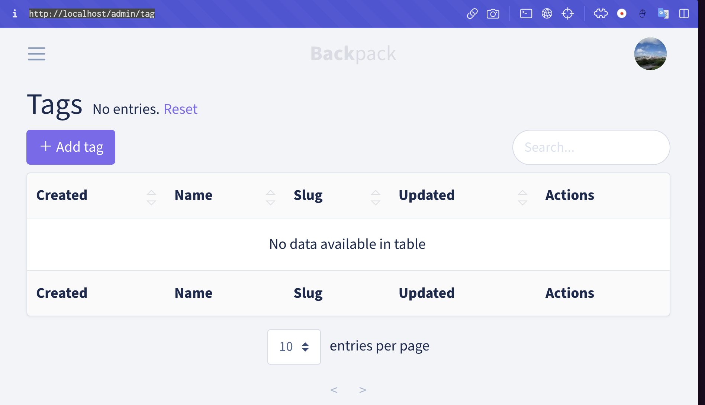

## What is Backpack?
Backpack 是一個很多個 Laravel Packages 的集合，用來做客製化的 admin panels，可以讓 admin 登入並進行 CRUD 操作。
在前端的部分， Backpack 有著類似於 bootstrap 的設計（CoreUI theme），官方命名為 __Backstrap__。簡單來說，當我們在寫前端的時候，Backpack 裡面就有一些 HTML Blocks 可以直接套用。
在後端的部分，Backpack 也可以幫助使用者創建 CRUD Panels。
## Installation
開始來試用一下 Laravel Backpack
雖然 Backpack 的版本跟的算緊，但在~~撰寫當下(2023/4/10) 只支援 Laravel 9~~（後來發現有支援 Laravel 10），因為不想變動本機的環境，所以我使用 [Laravel sail](https://laravel.com/docs/10.x/sail#executing-artisan-commands) 來建一個 container:

```shell
composer create-project laravel/laravel backpackTest1 9
cd backpackTest1/
composer require laravel/sail --dev
php artisan sail:install
sail artisan migrate
sail up
```
（如果對 Laravel sail 不熟悉，可以使用本地端的）

建完專案之後，開始安裝 backpack:
```shell
sail composer require backpack/crud
sail artisan backpack:install
```
裝的時候會問要不要建一個 admin 帳號，就先建一個起來吧～
裝好之後，進到 `http://localhost/admin/` 就會看到以下畫面。

輸入剛剛創建好的 admin 帳號之後，就可以進到 dashboard 了～

## CRUD
接著來看官方的 Text Course。
要用 CRUD 首先就要在資料庫建表，官方是推薦使用 [laracasts/generators](https://github.com/laracasts/Laravel-5-Generators-Extended)，看了一下 github 頁面，似乎是一個可以在 CLI 介面生成 migration file 的一些資訊。
但其實不裝應該也不會怎樣（吧）。
```shell
# STEP 0. install a 3d party tool to generate migrations
sail composer require --dev laracasts/generators 
sail composer require --dev backpack/generators

# STEP 1. create a migration
sail artisan make:migration:schema create_tags_table --model=0 --schema="name:string:unique,slug:string:unique" 
sail artisan migrate

# STEP 2. create a CRUD for it 
sail artisan backpack:crud tag #use singular, not plural
```

用上面的指令之後，會產生：
-   a **migration** file
-   a **model** (`app\Models\Tag.php`)
-   a **request** file, for form validation (`app\Http\Requests\TagCrudRequest.php`)
-   a **controller** file, where you can customize how the CrudPanel looks and feels (`app\Http\Controllers\Admin\TagCrudController.php`)
-   a **route**, as a line inside `routes/backpack/custom.php`
    此外，也會加入：
-   a route inside `routes/backpack/custom.php`, pointing to that controller;
-   a sidebar item inside `resources/views/vendor/backpack/base/inc/sidebar_content.blade.php`;

在這裡不會有 view 產生，因為在大部分使用 Backpack 的情況下，是不需要 custom views 的。所有的 custom code 都在 controller, model 或 request 裡面。

建完之後，這時候把 url 改成 `http://localhost/admin/tag` 就會神奇的出現頁面了！

稍微玩了一下，似乎是已經把 CRUD 都做好了。

根據官方文件所說，我們暫時不用去管 __migration__, __model__, __request__，因為他們沒辦法客製化。唯一需要注意的是要看 model 有沒有正確的配置（e.g. db table, relationships, `$fillable` or `$guarded` ）。
目前我們只需要專注在 `TagCrudController` 這個檔案即可，大部分的邏輯操作都會在裡面

在 controller 裡面有兩個 method：`setupCreateOperation()` and `setupUpdateOperation()`，是用來定義我們要讓 admin 看到什麼 field。
```php
protected function setupCreateOperation()  
{  
    CRUD::setValidation(TagRequest::class);  
  
    CRUD::field('name');  
    CRUD::field('slug');  
}
```
像現在裡面只有 name 和 slug，如果沒有指定 type 的話預設是 text。
在官方教學有提到，一點典型的 field 需要至少有三個要素：
-   `name` - the attribute (column in the database), which will also become the name of the input;
-   `type` - the kind of field we'd like to use (text, number, select2, etc);
-   `label` - the human-readable label for the input (will be generated from `name` if not given);
### e.g. Add a field "price"
如果我們想要為每一個 tag 新增一個 price 要怎麼做呢？
首先要在資料庫 tag table 裡面新增一個 column: price。
然後修改`setupCreateOperation()` and `setupUpdateOperation()`：
```php
protected function setupListOperation()  
{  
    CRUD::column('created_at');  
    CRUD::column('name');  
    CRUD::column('slug');  
    CRUD::column('price')->type('number');  // CRUD::addColumn(['name' => 'price', 'type' => 'number']);
    CRUD::column('updated_at');  
}
```

```php
protected function setupCreateOperation()  
{  
    CRUD::setValidation(TagRequest::class);  
  
    CRUD::field('name');  
    CRUD::field('slug');  
    CRUD::field('price')->type('number');  // CRUD::addField(['name' => 'price', 'type' => 'number']));
}
```

在 table 上和新增頁，就會出現 price 了～

### Article Model
官網上有簡單提到建另一個 model `Article`，並和 tag 建立多對多關係。
來試著實作看看。
首先一樣來產生 article 相關的檔案：
```php
# STEP 1. create a migration
sail artisan make:migration:schema create_articles_table --model=0 --schema="topic:string:unique,slug:string:unique,content:text" 
sail artisan migrate

# STEP 2. create a CRUD for it 
sail artisan backpack:crud article #use singular, not plural
```
然後建一個 pivot 表：
```shell
sail artisan make:migration create_articles_tags_table
```

```php
public function up()  
{  
    Schema::create('articles_tags', function (Blueprint $table) {  
        $table->id();  
        $table->unsignedBiginteger('article_id')->unsigned();  
        $table->unsignedBiginteger('tag_id')->unsigned();  
  
        $table->foreign('article_id')->references('id')  
            ->on('articles')->onDelete('cascade');  
        $table->foreign('tag_id')->references('id')  
            ->on('tags')->onDelete('cascade');  
  
        $table->timestamps();  
    });  
}
```

然後依照剛剛對 tag 的步驟，對 article 做一樣的事情
```php
protected function setupListOperation()  
{  
    CRUD::column('created_at');  
    CRUD::column('topic');  
    CRUD::column('slug');  
    CRUD::column('updated_at');  
  
}  
  
protected function setupCreateOperation()  
{  
    CRUD::setValidation(ArticleRequest::class);  
  
    CRUD::field('topic');  
    CRUD::field('slug');  
    CRUD::field('content');  
    CRUD::field('slug');  
}
```

在 `tagCrudController` 新增下拉式選單：
```php
protected function setupCreateOperation()  
{  
    CRUD::setValidation(TagRequest::class);  
  
    CRUD::field('name');  
    CRUD::field('slug');  
    CRUD::field('price')->type('number');  
    CRUD::addField([  
        'type' => 'select2_multiple',  
        'name' => 'articles', // the relationship name in your Model  
        'entity' => 'articles', // the relationship name in your Model  
        'attribute' => 'topic', // attribute on Article that is shown to admin  
        'pivot' => true, // on create&update, do you need to add/delete pivot table entries?  
    ]);  
}
```
接著在 `http://localhost/admin/article` 隨便新增幾個文章，最後會做出像這樣的效果：

有需要的話，也可以在 articleCrudController 裡面也加入 tags，我自己有做，但在這裡就不演示。
### Columns
在 backpack 裡面提供了很多 column，可以在[官網](https://backpackforlaravel.com/docs/5.x/crud-columns#default-column-types)查詢
我們也可以在 `setupListOperation()` 裡面，為某個 column 設定細節：
```php
protected function setupListOperation()  
{  
    CRUD::column('created_at');  
    CRUD::column('name');  
    CRUD::column('slug');  
    CRUD::column('price')->type('number');  
    CRUD::column('updated_at');  
    CRUD::setColumnDetails('price',[  
        'label'=>'Tag Price',  
        'prefix'=>'$'  
    ]);  
}
```
如此，我的 price 欄位會有微妙的變化XD


## 結語
今天稍微介紹了 Backpack 的基本，和最簡單的用法。
之後會再介紹如何新增 filter 和 button 之類的東西。