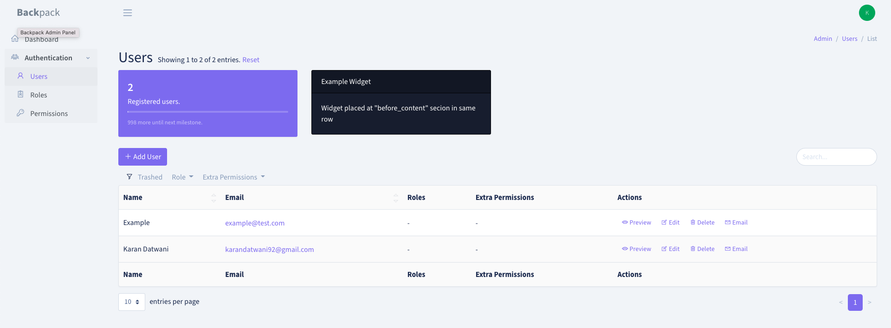
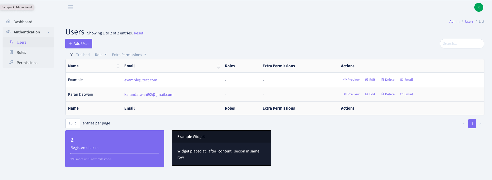
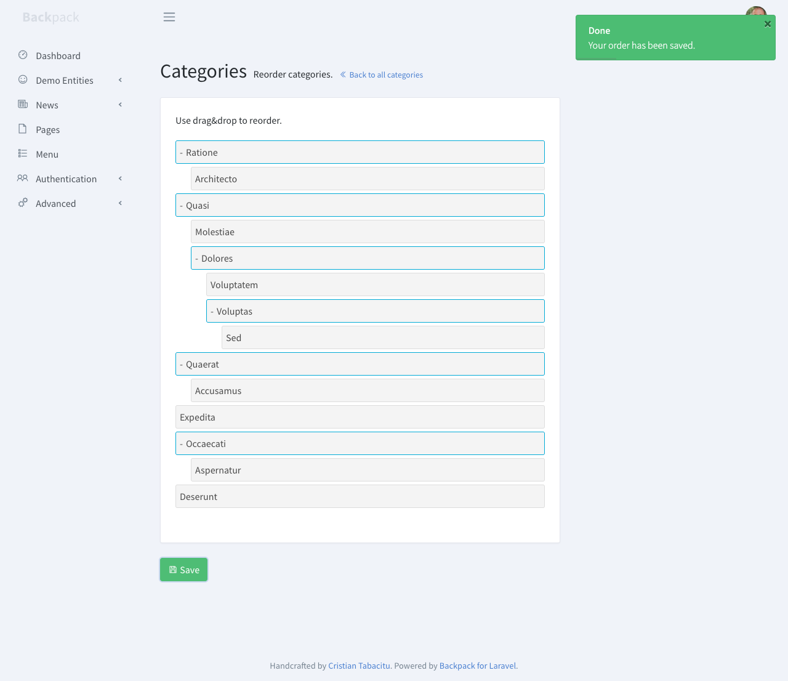
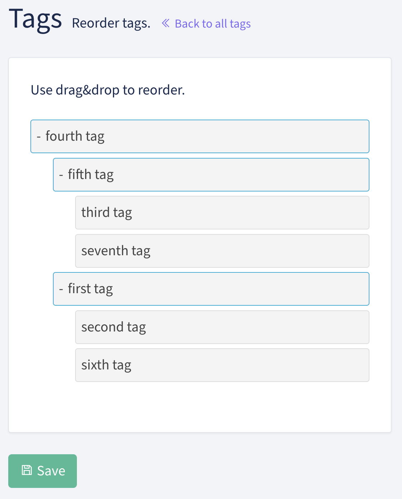

第二天依然來看 backpack 的 text course: Advanced Features。
基本上是有蠻多 operations 和 features。
官方教學文檔有提到這些東西先看看就好，所以在這裡先以了解使用方式為主，不會深究具體的實現方式。

---

## Other Operations
### Show
這個 operation 是讓 admin 有一個網頁可以看一個 entry 裡面的詳細資料，比如說有些文章的 content 不會顯示在清單頁，但可以利用 show operation 做到檢視。
它會在 ListEntries View 新增一個 preview。

如果是透過前一篇的指令 `sail artisan backpack:crud tag` 生成的 controller，內建就會包含 `use \Backpack\CRUD\app\Http\Controllers\Operations\ShowOperation;`。如果沒有的話要加上這行才可以用 show operation。
然後可以用 `sail artisan route:list` 看一下怎麼到 preview 網頁，基本上是用 `admin/article/{id}/show`。
#### How to configure
預設是會列出所有在資料庫裡面的資訊，但如果不想要這麼多，可以客製化。
可以在 crudController 裡面放一個 `setupShowOperation()` 。
如果想要讓 preview 頁面顯示的東西、設定、順序都跟 ListEntries View 一樣，可以用以下指令：
```php
protected function setupShowOperation() 
{ 
    $this->setupListOperation(); 
}
```
當然，如同 `setupListOperation()` 一樣，如果想要更動顯示順序、設定，也是可以自己再另外寫，詳見[官網](https://backpackforlaravel.com/docs/5.x/crud-operation-show)。

#### How to add custom sections(aka. Widgets)
在 show 的頁面上，可以加入一些 widgets，像是卡片、圖表之類的。
可以使用預設的 widget type，也可以創建自己的 widgets。
Backpack 預設提供兩個可以放 widgets 的 section:
* before_content
* after_content
  我們可以用以下官方提供的程式碼來試用看看 widget:
```php
public function setupShowOperation()
{    
    // dynamic data to render in the following widget
    $userCount = \App\Models\User::count();

    //add div row using 'div' widget and make other widgets inside it to be in a row
    Widget::add()->to('before_content')->type('div')->class('row')->content([

        //widget made using fluent syntax
        Widget::make()
            ->type('progress')
            ->class('card border-0 text-white bg-primary')
            ->progressClass('progress-bar')
            ->value($userCount)
            ->description('Registered users.')
            ->progress(100 * (int)$userCount / 1000)
            ->hint(1000 - $userCount . ' more until next milestone.'),

        //widget made using the array definition 
        Widget::make(
            [
                'type'       => 'card',
                'class'   => 'card bg-dark text-white',
                'wrapper' => ['class' => 'col-sm-3 col-md-3'],
                'content'    => [
                    'header' => 'Example Widget',
                    'body'   => 'Widget placed at "before_content" secion in same row',
                ]
            ]
        ),
    ]);

    //you can also add Script & CSS to your page using 'script' & 'style' widget
    Widget::add()->type('script')->stack('after_scripts')->content('https://code.jquery.com/ui/1.12.0/jquery-ui.min.js');
    Widget::add()->type('style')->stack('after_styles')->content('https://cdn.jsdelivr.net/npm/@shoelace-style/shoelace@2.0.0-beta.58/dist/themes/light.css');
}
```

在 `Widget::add()->to('before_content')` 可以看到這邊使用了 `before_content` ，所以理論上 widget 會顯示在預設要顯示的東西之上。

同理可知，如果用 `after_content`，widget 就會在下面：

#### How to overwrite
雖然預設的頁面看起來不錯，但我們可能仍想要更動 show 的邏輯。
目前頁面顯示的邏輯是寫在`ShowOperation.php`裡面，`show()`這個 method
而 EntityCrudController 是繼承了 `ShowOperation` 這個 trait，所以我們可以在 EntityCrudOperation 裡面自己寫一個 `show()` 就可以為不同的 entity 客製化顯示邏輯喔。
如官網範例：
```php
use \Backpack\CRUD\app\Http\Controllers\Operations\ShowOperation { show as traitShow; }

public function show($id)
{
    // custom logic before
    $content = $this->traitShow($id);
    // custom logic after
    return $content;
}
```

### Reorder
這個 operation 可以讓 admin 可以重新排列，或巢狀排列 entries。

#### Requirements
為了要使用 reorder，model 需要有幾個 integer fields，並預設值為零:
* parent_id -> 必須要是 nullable
* lft
* rgt
* depth

#### Usage
首先必須要在資料庫加上上面提到的四個欄位。
在 entryCrudController 加上：
```php
protected function setupReorderOperation(){
    CRUD::set('reorder.label', 'name');
    CRUD::set('reorder.max_level', 2);
}
```
這兩行可以：
* 讓使用者可以使用 reorder operation
* 在 "add entry " 按鈕旁邊會出現一個 "Reorder" 按鈕
* 開啟到 Reorder 的 router

這時候看 route:list 會看到：
```shell

GET|HEAD  admin/tag/reorder .................... tag.reorder › Admin\TagCrudController@reorder
POST      admin/tag/reorder ........... tag.save.reorder › Admin\TagCrudController@saveReorder

```
所以輸入 url 就會到 reorder 的介面：


目前顯示在 reorder 介面的會是 entry 的 name。如果想要顯示其他東西可以把 `'name'` 改成自己想要顯示的 (e.g. `'slug'`)
數字 2 代表最大可以接受的深度，如果沒有限制的話，可以設為 0。

此時可以進到 reorder 的頁面玩玩看，但玩完按 save 回到主頁之後，會發現什麼都沒有變。
原因是因為主頁還是用預設的排序方式，如果想要更改排序方式可以：
```php
protected function setupListOperation()
{
    CRUD::column('created_at');
    CRUD::column('name');
    CRUD::column('slug');
    CRUD::column('price')->type('number');
    CRUD::column('updated_at');
    CRUD::setColumnDetails('price',[
        'label'=>'Tag Price',
        'prefix'=>'$'
    ]);
    CRUD::orderBy('lft');
}

```
這樣就會按照 `lft` 排序～

官方文件有提到，在 reorder 介面中同樣可以加入 widget，基本上是用和 `show` 一樣的方式。在這邊就不實作了。

#### 補充：lft and rgt
在實作的時候，我還蠻好奇 `lft` 和 `rgt` 到底是怎麼被算出來的。
稍微查了一下，nest entries 實際上就是一個 tree，backpack 會對對 tree 進行 preorder traversal（不過是改編版的）。然後算出 `lft` and `rgt`。
舉例來說，如果現在 nest entries 長這樣：
![[Pasted image 20230411121316.png|500]]
算出 lft and rgt 的步驟為：
1. 從 root(fourth tag) 開始，lft of fourth tag = 2（初始值為 2）
2. 到 fourth tag 的第一個 child (fifth tag)，lft of fifth tag = 3 (2+1)
3. 到 fifth tag 的第一個 child (third tag)，lft of third tag = 4
4. third tag 沒有 child，所以 rgt of third tag = 5
5. move back to the parent (fifth tag)
6. fifth tag 的第二個 child (seventh tag)，lft of seventh tag = 6
7. seventh tag 沒有 child，所以 rgt of seventh tag = 7
8. move back to the parent (fifth tag)
9. fifth tag 沒有其他 child 了，所以 rgt of seventh tag = 8
10. move back to the parent (fourth tag)
11. 到 fourth tag 的第二個 child (first tag)，lft of first tag = 9
12. ...以此類推

最後求完會如下表：
| id | name | slug | price | parent\_id | lft | rgt | depth | created\_at | updated\_at |
| :--- | :--- | :--- | :--- | :--- | :--- | :--- | :--- | :--- | :--- |
| 1 | first tag | firsttag | 30 | 4 | 9 | 14 | 2 | 2023-04-11 01:20:01 | 2023-04-11 04:03:55 |
| 2 | second tag | secondtag | 40 | 1 | 10 | 11 | 3 | 2023-04-11 01:20:13 | 2023-04-11 04:03:55 |
| 3 | third tag | thirdtag | 50 | 5 | 4 | 5 | 3 | 2023-04-11 01:20:41 | 2023-04-11 04:03:55 |
| 4 | fourth tag | fourthtag | 50 | null | 2 | 15 | 1 | 2023-04-11 03:51:11 | 2023-04-11 04:03:55 |
| 5 | fifth tag | fifthtag | 70 | 4 | 3 | 8 | 2 | 2023-04-11 03:51:24 | 2023-04-11 04:03:55 |
| 6 | sixth tag | sixthtag | 90 | 1 | 12 | 13 | 3 | 2023-04-11 04:03:31 | 2023-04-11 04:03:55 |
| 7 | seventh tag | seventhtag | 90 | 5 | 6 | 7 | 3 | 2023-04-11 04:03:43 | 2023-04-11 04:03:55 |

然後如果要 print 出來的話，就用 lft and rgt 來重建原本的 tree：
1.  選擇 lft 最小的 node 作為 root（在這個例子中是 fourth tag）。
2.  尋找 lft 值介於 root 的 lft 和 rgt 之間的 node，並且其 depth 比 root 多1。這些 node 將成為 root 的 child node（在這個例子中是 fifth tag 和 first tag）。
3.  對於每個 child node，重複步驟 2，直到所有 node 都被訪問。

### Revise
Revise 可以讓 admin 去儲存、查看、取消對於一個 entries 的修改。
類似版本管理系統，admin 可以在頁面上看到所有的 change 和此次修改是誰做的。

#### Usage
其實過程蠻簡單的，裝好、建好表就差不多了。
要先安裝這個 package。
```shell
composer require backpack/revise-operation
```
然後建一個用來存修改的表：
```shell
cp vendor/venturecraft/revisionable/src/migrations/2013_04_09_062329_create_revisions_table.php database/migrations/ && php artisan migrate
```

然後在 model 裡面，新增一個 `identifiableName()` method，讓 admin 可以分辨不同的 entries(e.g. name, title...)。
如果又用到別的 bootable trait，要去 override 掉：
```php
namespace App\Models;

class Article extends Eloquent {
    use \Backpack\CRUD\app\Models\Traits\CrudTrait, \Venturecraft\Revisionable\RevisionableTrait;

    public function identifiableName()
    {
        return $this->name;
    }

    // If you are using another bootable trait
    // be sure to override the boot method in your model
    public static function boot()
    {
        parent::boot();
    }
}
```

最後，在 CrudController，使用 operation trait:
```php
<?php

namespace App\Http\Controllers\Admin;

use Backpack\CRUD\app\Http\Controllers\CrudController;

class ArticleCrudController extends CrudController
{
    use \Backpack\ReviseOperation\ReviseOperation;
```
這樣就可以正常使用了！
下表為 revision 表：
| id | revisionable\_type | revisionable\_id | user\_id | key | old\_value | new\_value | created\_at | updated\_at |
| :--- | :--- | :--- | :--- | :--- | :--- | :--- | :--- | :--- |
| 1 | App\\Models\\Article | 1 | 1 | topic | My first article | My first article. haha | 2023-04-11 05:03:18 | 2023-04-11 05:03:18 |
| 2 | App\\Models\\Article | 1 | 1 | slug | 1starticle | 1starticle-haha | 2023-04-11 05:03:18 | 2023-04-11 05:03:18 |
| 3 | App\\Models\\Article | 1 | 1 | content | This is my first article. | This is my first article. and I want to do revision | 2023-04-11 05:03:18 | 2023-04-11 05:03:18 |

官方文件上還列出另外三個 operations:
* Clone
* BulkDelete
* BuldClone

但稍微看了一下，好像都是介紹用法而已，就不特別研究ㄌ。
