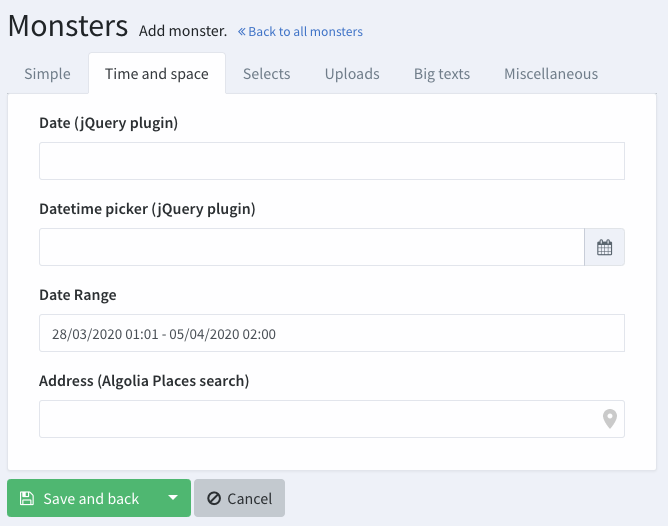

這篇主要是要來研究 Fields。

---

## Intro.
在前兩篇可以看到，fields types 定義了 admin 可以如何輸入資料，例如 text, datepicker, upload button...等等。通常是給 Create or Update 使用。

在 Backpack 裡面，有很多的預設的 field types，也可以創建自己的 field。如果只是要做一點點修改，也可以 overwrite 原本的 field type 就好。

---

## Fields API
在官網上列出了用於操作 fields 的一些方法。

這些 method 會在 operation 裡面運作，所以一定要放在 `setupCreateOperation()` 、 `setUpdatePeration()`  or `setup()` 裡面。

（好像在 version 5 之後，也可以使用靜態的方式去 call，如 `CRUD::addfield()`。
```php
// add a field 
$this->crud->addField($field_definition_array);

// shorthand: add a text field 
$this->crud->addField('db_column_name');

// add multiple fields
$this->crud->addFields([$field_definition_array_1, $field_definition_array_2]);

// change the attributes of a field
$this->crud->modifyField($name, $modifs_array);

// remove a field from both operations
$this->crud->removeField('name');

// remove multiple fields from both operations
$this->crud->removeFields($array_of_names);

// remove all fields from all operations
$this->crud->removeAllFields();

// FIELD ORDER

// add a field before a given field
$this->crud->addField($field_definition_array)->beforeField('name');

// add a field after a given field
$this->crud->addField($field_definition_array)->afterField('name');

// -------------------
// New in Backpack 4.1
// -------------------
// add a field with this name
$this->crud->field('price');

// change the type attribute on the 'price' field
$this->crud->field('price')->type('number');
```

---

## Field Attributes
### Mandatory Field Attributes
只有一個 attributes 是強迫要有的： `name`。

這個 `name` 會被怎麼使用？官網上提供了兩個：

-   inside the inputs, as `<input name='your_db_column' />`;
-   to store the information in the database, so your `name` should correspond to a database column (if the field type doesn't have different instructions);

### Recommended Field Attributes
一個 field 也最好有以下的 field:
-   the `name` of the column in the database (ex: "title")
-   the human-readable `label` for the input (ex: "Title")
-   the `type` of the input (ex: "text")
    如果 label 被省略的話， backpack 會嘗試從 `name` 猜一下 label。

如果 `type` 被省略的話， backpack 會根據 column type 來猜，或是 Model 有一個名為 `name` 的 relationship。


#### Field Attributes for Presentation Purposes
有一些選擇性可用的 attributes 可以用在大部分的 default field types 上，可以讓人很簡單的達到一些效果：
```php
[
    'prefix'     => '',
    'suffix'     => '',
    'default'    => 'some value', // set a default value
    'hint'       => 'Some hint text', // helpful text, shows up after the input
    'attributes' => [
       'placeholder' => 'Some text when empty',
       'class'       => 'form-control some-class',
       'readonly'    => 'readonly',
       'disabled'    => 'disabled',
     ], // change the HTML attributes of your input
     'wrapper'   => [ 
        'class'      => 'form-group col-md-12'
     ], // change the HTML attributes for the field wrapper - mostly for resizing fields 
]
```
看起來蠻有用的，之前有用過 `'prefix'`，可以加入前贅詞。
#### Fake Field Attributes (stores fake attributes as JSON in the database)
如果今天要存的資料有多種，但資料庫裡只有一欄，此時就需要先把資料轉成 JSON 格式再存進資料庫。

預設來說，會存在 `extras` 這個 column。

要使用 fake field attributes，有以下步驟：
1. 在 field 裡面加入 fake attribute
   ```php
   [
        'name'     => 'name', // JSON variable name
        'label'    => "Tag Name", // human-readable label for the input

        'fake'     => true, // show the field, but don't store it in the database column above
        'store_in' => 'extras' // [optional] the database column name where you want the fake fields to ACTUALLY be stored as a JSON array 
    ],
    ```
2. 在 model 裡面，要確認存 JSONs 的 db columns(default: extras) 有：
    * In the `$fillable` property;
    * on a new `$fakeColumns` property(create it now)
    * are cast as array in `$casts`
#### Tab Attribute Splits Forms into Tabs
可以把 create/edit input 放在不同的 tabs 裡面。

如果要使用這個功能，要在 field attribute 裡面加上 'tab'。
舉例而言，如果我想要把 `price` 放在  `test` 這個 tab 裡面，然後把 `articles` 這個 select2_multiple 放在 `hello` 這個 tab 裡面，可以這樣寫：
```php
CRUD::addField([  
    'name'=>'price',  
    'type'=>'number',  
    'tab'=>'test'  
]);  
CRUD::addField([  
    'type' => 'select2_multiple',  
    'name' => 'articles', // the relationship name in your Model  
    'entity' => 'articles', // the relationship name in your Model  
    'attribute' => 'topic', // attribute on Article that is shown to admin  
    'pivot' => true, // on create&update, do you need to add/delete pivot table entries?  
    'tab'=>'hello'  
]);
```
最後呈現出來的效果：


可以看到如果沒有指定 tab 的，會獨立是一個 component，放在所有 tabs 的上面。

#### Attributes For Fields Containing Related Entries
這邊主要是在說，如果 field works with related entities( relationships like `BelongsTo` , `HasOne`, `HasMany`, `BelongsToMany`, etc)，有一些參數需要/可以設定。

-   `entity` - points to the method on the model that contains the relationship; having this defined, Backpack will try to guess from it all other field attributes; ex: `category` or `tags`;
-   `model` - the classname (including namespace) of the related model (ex: `App\Models\Category`); usually deduced from the relationship function in the model;
-   `attribute` - the attribute on the related model (aka foreign attribute) that will be show to the user; for example, you wouldn't want a dropdown of categories showing IDs - no, you'd want to show the category names; in this case, the `attribute` will be `name`; usually deduced using the [identifiable attribute functionality explained below](https://backpackforlaravel.com/docs/5.x/crud-fields#identifiable-attribute);
-   `multiple` - boolean, allows the user to pick one or multiple items; usually deduced depending on whether it's a 1-to-n or n-n relationship;
-   `pivot` - boolean, instructs Backpack to store the information inside a pivot table; usually deduced depending on whether it's a 1-to-n or n-n relationship;
-   `relation_type` - text, deduced from `entity`; not a good idea to overwrite;

其實看前幾天做的 `select2_multiple` 大概就可以知道怎麼用了。

---

## 很多個 field
文件後面就是各個不同的 field 介紹，這個就挑著記。

### Relationship
會給 user 一個 `select2` input，讓使用者可以選擇一個或多個關聯的 Eloquent Model 的 entires。
為了要正常運作，在 Model 裡面必須要正確定義 relationships。
在官網上有列出有支持的 relationships。
#### Load entries from AJAX calls - using the Fetch Operation
如果同時要 load 很多 entries，用 onpage Eloquent query 速度可能會很慢。
在這種情況下，可以叫 `relationship` field 透過 AJAX calls 來拿到 entries。
要達成這樣的效果，有以下步驟：
1. Add `'ajax' => true` to your relationship field definition:
   ```php
   [   // relationship
    'type' => "relationship",
    'name' => 'category', // the method on your model that defines the relationship
    'ajax' => true,

    // OPTIONALS:
    // 'label'       => "Category",
    // 'attribute'   => "name", // foreign key attribute that is shown to user (identifiable attribute)
    // 'entity'      => 'category', // the method that defines the relationship in your Model
    // 'model'       => "App\Models\Category", // foreign key Eloquent model
    // 'placeholder' => "Select a category", // placeholder for the select2 input

    // AJAX OPTIONALS:
    // 'delay'                   => 500, // the minimum amount of time between ajax requests when searching in the field
    // 'data_source'             => url("fetch/category"), // url to controller search function (with /{id} should return model)
    // 'minimum_input_length'    => 2, // minimum characters to type before querying results
    // 'dependencies'            => ['category'], // when a dependency changes, this select2 is reset to null
    // 'method'                  => 'POST', // optional - HTTP method to use for the AJAX call (GET, POST)
    // 'include_all_form_fields' => false, // optional - only send the current field through AJAX (for a smaller payload if you're not using multiple chained select2s)
    ],
    ```
   主要應該是 `'ajax'=>true` 這行。
   所以我嘗試在  `ArticleCrudController.php` 裡面把原本的 `select2` 改掉：
```php
    CRUD::addField([  
        'label' => "Tags",  
        'type' => 'relationship',  
        'name' => 'tags', // the method that defines the relationship in your Model  
        'entity' => 'tags', // the method that defines the relationship in your Model  
        'attribute' => 'name', // foreign key attribute that is shown to user  
        'pivot' => true, // on create&update, do you need to add/delete pivot table entries?  
        'ajax'=>true  
    ]);
```

此時應該是會報錯，看起來是根本沒有 router：


2. 這時候就要到第二步驟，在`ArticleCrudController.php`加入以下程式碼：
   ```php
    use \Backpack\CRUD\app\Http\Controllers\Operations\FetchOperation;

    public function fetchTags()
    {
        return $this->fetch(\App\Models\Tag::class);
    }
    ```
   這段程式碼的用途就是要開一個對應到 AJAX Calls 的 route 和 method。
   會幫我們設定好 `/fetch/tag` route，會導到 `fetchTags()`，並 return 搜尋結果。
   感覺蠻有趣的，[官方文件]([FetchOperation docs](https://backpackforlaravel.com/docs/5.x/crud-operation-fetch))有說明更多關於怎麼 operation 怎麼運作的，不過先暫時跳過...

#### Create related entries in a modal - using the InlineCreate Operation
使用者去使用 AJAX 做搜尋，有可能根本沒有這個資料。

所以可能會需要讓使用者在不用離開原本的頁面下，新增一個 related entry。(e.g. 在 create article 的頁面新增一個 tag)

這個功能可以使用在 `BelongsTo`, `BelongsToMany`, `MorphToMany` relationships。


要使用這個功能，要先使用 Fetch operation 去拿到 entries。

然後再照以下步驟：

1. 增加 `inline_create` 在 field definition
```php
    // for 1-n relationships (ex: category)
[
'type'          => "relationship",
'name'          => 'category',
'ajax'          => true,
'inline_create' => true, // <--- THIS
],
// for n-n relationships (ex: tags)
[
'type'          => "relationship",
'name'          => 'tags', // the method on your model that defines the relationship
'ajax'          => true,
'inline_create' => [ 'entity' => 'tag' ]  // <--- OR THIS
],
// in this second example, the relation is called `tags` (plural),
// but we need to define the entity as "tag" (singural)
```

這時候應該會看到以下 bug，跟上面的 fetch 一樣，目前還沒有 route 可以處理這個請求。所以要進入第二步驟。

2. 要在 secondary entity （在這個例子中是 TagCrudController）中 use InlineCreate operation
   ```php
       class TagCrudController extends CrudController
    {
        use \Backpack\CRUD\app\Http\Controllers\Operations\InlineCreateOperation;

       // ...
    }
   ```
   加入之後看 `artisan route:list` 就會看到 backpack 幫我們生成一個 route 了：
   ```shell
        GET|HEAD  admin/tag/create ....................... tag.create › Admin\TagCrudController@create
      POST      admin/tag/inline/create tag-inline-create-save › Admin\TagCrudController@storeInlin…
      POST      admin/tag/inline/create/modal tag-inline-create › Admin\TagCrudController@getInline…
    ```

`InlineCreateOperation` 會讓 modal 顯示和 Create Operation 一樣的 field。

#### Save additional data to pivot table
對於有 pivot table 的 relationship(n2n: `BelongsToMany`, `MorphToMany`)，這個 pivot table 除了 foreign key 之外，還可能包含其他列。

`relationship` field 提供了一個快速的方法，讓 admin 可以編輯這些 "extra attributes" 。

舉例而言，如果有以下 db tables:
```php
// - companies: id, name
// - company_person: company_id, person_id, job_title, job_description
// - persons: id, first_name, last_name
```

在 `company_person` 這個 pivot table 裡面，我們可能想要讓 admin 去編輯特定使用者的 `job_title` 或是 `job_description` 。如下圖：


步驟如下（在這裡就不實作ㄌ）：
1. 在 model 裡面，確認 pivot 有被 define（使用 `withPivot()`）:
```php
// inside the Company model
public function people()
{
    return $this->belongsToMany(\App\Models\Person::class)
                ->withPivot('job_title', 'job_description');
}
// inside the Person model
public function companies()
{
    return $this->belongsToMany(\App\Models\Company::class)
                ->withPivot('job_title', 'job_description');
}
```
2. 在 `relationship` field defintion, 加入 `subfield`
```php
// Inside PersonCrudController
[
    'name'          => 'companies',
    'type'          => "relationship",
     // ..
    'subfields'   => [
        [
            'name' => 'job_title',
            'type' => 'text',
            'wrapper' => [
                'class' => 'form-group col-md-3',
            ],
        ],
        [
            'name' => 'job_description',
            'type' => 'text',
            'wrapper' => [
                'class' => 'form-group col-md-9',
            ],
        ],
    ],
],
```


#### Manage related entries in the same form (create, update, delete)
有時候對於 `hasMany` 和 `morphMany` relationships，secondary entry 高度依賴 primary entry，所以我們可能不想要在一個額外的懸浮式視窗來編輯這個 secondary entry。
#### Delete related entries or fall back to default
一般而言，當 admin 在 "select" 裡面移除了一個 relationship，只有 relationship 被移除，related entry 會保留。

但對於 `hasMany` 和 `morphMany` 來說，有時候我們可能也會想要移除一整個 relationship。

如下例：
```php
// Inside ArticleCrudController
[
    'type'          => "relationship",
    'name'          => 'comments',
    // when removed, use fallback_id
    'fallback_id'   => 3, // will relate to the comment with ID "3"
    // when removed, delete the entry
    'force_delete'  => true, // will delete that comment
],
```
### Repeatable
有時候我們可能想要給 admin 可以同時新增很多欄位。

比如說，在「台灣國家公園入園入山申請」之中，可以按下「新增隊員」，就可以新增很多欄位 （for 這個隊員）。

這個時候就可以用到 repeatable。

從 backpack v5 版本開始，repeatable 會 return array，會需要在 model 裡面設定 cast 成 json，再存成資料庫。


可以按下 "New item" 按鈕，就會增加新的 subfields group（e.g. 一個新隊員）。

大部分的 field type 都可以用在 field group 裡面，也可以使用 `wrapper` 更改每個 field 的寬度。

但有以下事情是需要注意的：
* 所有在 group 裡面的 subfields 都需要定義清楚，Backpack 不會幫忙猜 Label 之類的。
* 有些 field type 是不可以在 subfield 使用的，例如 relationship field、upload、upload_multiple
* Validation: 可以透過 Laravel nested array validation 的方式來驗證 subfield 的資料。e.g. `testimonial.*.name => 'required'`
* Filed usage and relationships: 不能在 repeatable field 裡面再塞一個 repeatable field。

```php
[   // repeatable
    'name'  => 'testimonials',
    'label' => 'Testimonials',
    'type'  => 'repeatable',
    'subfields' => [ // also works as: "fields"
        [
            'name'    => 'name',
            'type'    => 'text',
            'label'   => 'Name',
            'wrapper' => ['class' => 'form-group col-md-4'],
        ],
        [
            'name'    => 'position',
            'type'    => 'text',
            'label'   => 'Position',
            'wrapper' => ['class' => 'form-group col-md-4'],
        ],
        [
            'name'    => 'company',
            'type'    => 'text',
            'label'   => 'Company',
            'wrapper' => ['class' => 'form-group col-md-4'],
        ],
        [
            'name'  => 'quote',
            'type'  => 'ckeditor',
            'label' => 'Quote',
        ],
    ],

    // optional
    'new_item_label'  => 'Add Group', // customize the text of the button
    'init_rows' => 2, // number of empty rows to be initialized, by default 1
    'min_rows' => 2, // minimum rows allowed, when reached the "delete" buttons will be hidden
    'max_rows' => 2, // maximum rows allowed, when reached the "new item" button will be hidden
    // allow reordering?
    'reorder' => false, // hide up&down arrows next to each row (no reordering)
    'reorder' => true, // show up&down arrows next to each row
    'reorder' => 'order', // show arrows AND add a hidden subfield with that name (value gets updated when rows move)
    'reorder' => ['name' => 'order', 'type' => 'number', 'attributes' => ['data-reorder-input' => true]], // show arrows AND add a visible number subfield
],
```
### select2 系列
如同官方的敘述：

> Works just like the SELECT field, but prettier.

select 系列基本上會把全部選項列出來，如果要多選還要按著 shift。


select2 系列看起來就比較美觀，是類似 dropdown 這樣：


### Slug
Slug 看起來也蠻特殊的，可以在網頁直接把文字動態轉為符合網址的格式。
使用方式如下：
```php
CRUD::field('name');  
CRUD::addfield([  
    'name'=>'slug',  
    'target'=>'name',  
    'label'=>'Slug',  
    'type'=>'slug'  
]);
```
效果會如下（是動態的，但這裡用圖片示意）：


如果不想要是動態的，也可以將他暫停掉：
```php
    protected function setupUpdateOperation()
    {
        $this->setupCreateOperation();

        // disable editing the slug when editing
        $this->crud->field('slug')->target('')->attributes(['readonly' => 'readonly']);
    }
```

### Table
Table 感覺也是工作上會常常用的。
使用 Table 的話，會允許 multiple input，並把這些 input value 存成 JSON。
```php
[   // Table
    'name'            => 'options',
    'label'           => 'Options',
    'type'            => 'table',
    'entity_singular' => 'option', // used on the "Add X" button
    'columns'         => [
        'name'  => 'Name',
        'desc'  => 'Description',
        'price' => 'Price'
    ],
    'max' => 5, // maximum rows allowed in the table
    'min' => 0, // minimum rows allowed in the table
],
```

做出來會如下圖：


> [!note]
> 記得要在 model 設定 casting。

---

## Overwriting Default Field Types
Backpack 的 field types 通常都存在 `resources/views/fields`。

如果需要修改已經存在的 field，不用特別去改 package，只需要在 `/resources/views/vendor/backpack/crud/fields` 新增一個有同樣名字的 view。Backpack 會優先確認那裡有沒有檔案，如果沒有檔案才去 load package。

可以使用 `php artisan backpack:field --from=field_name` 來新增一個 field blade file，backpack 會幫忙新增。可以對新增完的檔案進行修改：
```php
{{-- number input --}}  
@include('crud::fields.inc.wrapper_start')  
    <label>{!! $field['label'] !!}</label>  
    @include('crud::fields.inc.translatable_icon')  
  
    @if(isset($field['prefix']) || isset($field['suffix'])) <div class="input-group"> @endif  
        @if(isset($field['prefix'])) <div class="input-group-prepend"><span class="input-group-text">{!! $field['prefix'] !!}</span></div> @endif  
        <input  
           type="number"  
           name="{{ $field['name'] }}"  
            value="{{ old_empty_or_null($field['name'], '') ??  $field['value'] ?? $field['default'] ?? '' }}"  
            @include('crud::fields.inc.attributes')  
           >  
        @if(isset($field['suffix'])) <div class="input-group-append"><span class="input-group-text">{!! $field['suffix'] !!}</span></div> @endif  
  
    @if(isset($field['prefix']) || isset($field['suffix'])) </div> @endif  
  
    {{-- HINT --}}  
    @if (isset($field['hint']))  
        <p class="help-block">{!! $field['hint'] !!}</p>  
    @endif  
    Hello  
@include('crud::fields.inc.wrapper_end')
```
像我在 number field type 的最後面加了一個 `Hello`，雖然沒什麼意義，但可以看一下效果：


---

## Creating a Custom Field Type
也可以自己創建一個新的field type，可以用以下指令：

```shell
// to create one using Backpack\Generators, run:
php artisan backpack:field new_field_name

// alternatively, to create a new field similar an existing field, run: 
php artisan backpack:field new_field_name --from=old_field_name
```

Field Defintion 可能會像：
```php
[   // Custom Field
    'name'  => 'address',
    'label' => 'Home address',
    'type'  => 'address'
    /// 'view_namespace' => 'yourpackage' // use a custom namespace of your package to load views within a custom view folder.
],
```

當然，我們也可以自己編輯 blade file。在這個 custom field type，可以用幾個變數：
-   `$crud` - all the CRUD Panel settings, options and variables;
-   `$entry` - in the Update operation, the current entry being modified (the actual values);
-   `$field` - all attributes that have been passed for this field;

---

## 結語
這篇文件蠻詳盡的介紹了 fields，從一開始介紹 attributes，到中間列出幾乎所有的 fields，最後介紹客製化。
