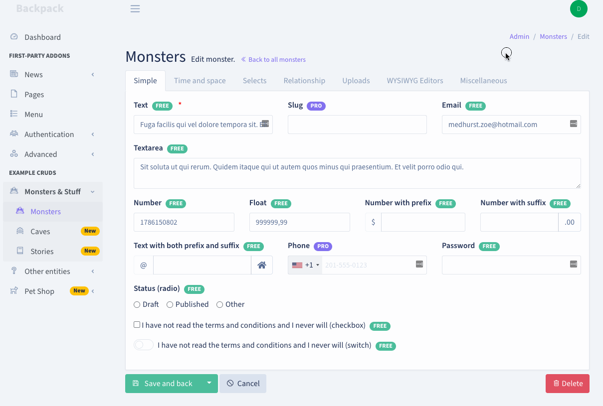
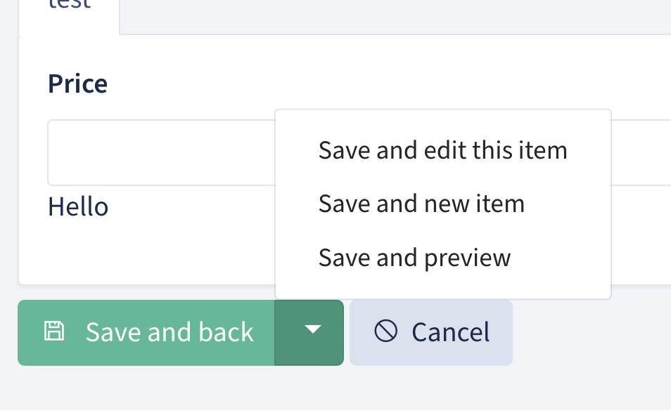

來研究 `UpdateOperation`

---

## How it works
基本的用法在前幾篇已經看過了，這邊先來看官方的解說。

CrudController 是一個 RESTful 的 controller，`Update` Operation 用了兩個 routes:
* GET to `/entity-name/{id}/edit`: 指到 `edit()` ，用來 render Edit Form(`edit.blade.php`)
* POST to `/entity-name/{id}/edit`: 指到 `update()`，使用 Eloquent 去 update database 的 entry

`edit()` 會 render 所有被定義的 fields(using fields API), 接著在保存時，`update()` 會對資料作 validation，在 Eloquent Model 創建 entry。只有 field type 被加入，且為 `$fiilable` 的會被真正存入資料庫。

---

## Advanced Features and Techniques
### Validation
backpack 提供三種方式，作為表單驗證的機制。

#### Validating fields using FormRequests
在產生 CrudController 的時候，會順帶產生一個 Laravel FormRequest，這個 FormRequest 會在 `setupUpdateOperation()` 裡面被使用。如果是 Article 的話，就是 `ArticleRequest::class` 。

```php
CRUD::setValidation(ArticleRequest::class);
```

對於比較大的 model 來說，這個方式很好用，因為可以在 `FormRequest` 裡面寫很多 rules, messages and attributes，而且不會影響到 `CrudController` 的大小。

如果今天 Create 和 Update 用來 validate 的方式不一樣，就要創建不同的 request file：

```php
use App\Http\Requests\CreateTagRequest as StoreRequest;
use App\Http\Requests\UpdateTagRequest as UpdateRequest;

// ...

public function setupCreateOperation()
{
    $this->crud->setValidation(CreateRequest::class);
}

public function setupUpdateOperation()
{
    $this->crud->setValidation(UpdateRequest::class);
}
```

#### Validating fields using a rules array
如果是小型的 model，要用另一個檔案來管理也蠻麻煩的，此時可以把 rules 直接寫成 array 就好。
```php
protected function setupUpdateOperation()
{
    $this->crud->setValidation([
        'name' => 'required|min:2',
    ]);

    // or maybe
    $rules = ['name' => 'required|min:2'];
    $messages = [
        'name.required' => 'You gotta give it a name, man.',
        'name.min' => 'You came up short. Try more than 2 characters.',
    ];
    $this->crud->setValidation($rules, $messages);
}
```

#### Validating fields using field attributes
另一個對於中小型 model 也不錯用的，是直接寫在 `addField()` 裡面：

```php
protected function setupUpdateOperation()
{
    $this->crud->addField([
        'name' => 'content',
        'label' => 'Content',
        'type' => 'ckeditor',
        'placeholder' => 'Your textarea text here',
        'validationRules' => 'required|min:10',
        'validationMessages' => [
            'required' => 'You gotta write smth man.',
            'min' => 'More than 10 characters, bro. Wtf... You can do this!',
        ]
    ]);
    // CAREFUL! This MUST be called AFTER the fields are defined, NEVER BEFORE
    $this->crud->setValidation();
}
```

如果使用這個方法的話，__一定要在最後 call `setValidation()`__，不用輸入任何 parameter。 Backpack 會自己去這些 field 裡面找對應的 rules。


### Callbacks

根據 Backpack 文件的說法，在 entry 被更新之前/之後，我們可能想要最一些事情。

但在 Laravel Backpack 是沒有 callback 可以用的，所以如果要達到這種效果，可以用以下幾種方式。

#### Use Events in your `setup()` method

Laravel 已經有提供幾個 events：
* `updating` and `updated`: triggered by the Update operation
* `saving` and `saved`： triggered by both the Create and the Update Operations。

舉例來說，如果想要在 `Product` entry 更新之前做一些事情，可以：
```php
public function setupUpdateOperation()
{

    // ...

    Product::updating(function($entry) {
        $entry->last_edited_by = backpack_user()->id;
    });
}
```

要注意的是，這些events 只有在 function 被 call 的時候才會 register，所以，如果把它定義在 `CrudController`：
*  they will NOT run when an entry is changed outside that CrudController;
-   if you want to expand the scope to cover both the `Create` and `Update` operations, you can easily do that, for example by using the `saving` and `saved` events, and moving the event-calling to your main `setup()` method;

#### Use Events in your field definition
可以在創建 field 的時候，就告訴 field 在 entry 要存進 db 的時候應該要做些什麼：

```php
// FLUENT syntax - use the convenience method "on" to define just ONE event
CRUD::field('name')->on('updating', function ($entry) {
    $entry->last_edited_by = backpack_user()->id;
});

// FLUENT SYNTAX - you can define multiple events in one go
CRUD::field('name')->events([
    'updating' => function ($entry) {
        $entry->last_edited_by = backpack_user()->id;
    },
    'saved' => function ($entry) {
        // TODO: upload some file
    },
]);

// using the ARRAY SYNTAX, define an array of events and closures
CRUD::addField([
    'name' => 'name',
    'events' => [
        'updating' => function ($entry) {
            $entry->author_id = backpack_user()->id;
        },
    ],
]);
```

#### Override the `update()` method

把 `update()`  複寫掉：
```php
<?php

namespace App\Http\Controllers\Admin;

use Backpack\CRUD\app\Http\Controllers\CrudController;

class ProductCrudController extends CrudController
{
    use \Backpack\CRUD\app\Http\Controllers\Operations\UpdateOperation { update as traitUpdate; }

    // ...

    public function update()
    {
        // do something before validation, before save, before everything; for example:
        // $this->crud->addField(['type' => 'hidden', 'name' => 'author_id']);
        // $this->crud->removeField('password_confirmation');

        // Note: By default Backpack ONLY saves the inputs that were added on page using Backpack fields.
        // This is done by stripping the request of all inputs that do NOT match Backpack fields for this
        // particular operation. This is an added security layer, to protect your database from malicious
        // users who could theoretically add inputs using DeveloperTools or JavaScript. If you're not properly
        // using $guarded or $fillable on your model, malicious inputs could get you into trouble.

        // However, if you know you have proper $guarded or $fillable on your model, and you want to manipulate 
        // the request directly to add or remove request parameters, you can also do that.
        // We have a config value you can set, either inside your operation in `config/backpack/crud.php` if
        // you want it to apply to all CRUDs, or inside a particular CrudController:
            // $this->crud->setOperationSetting('saveAllInputsExcept', ['_token', '_method', 'http_referrer', 'current_tab', 'save_action']);
        // The above will make Backpack store all inputs EXCEPT for the ones it uses for various features.
        // So you can manipulate the request and add any request variable you'd like.
        // $this->crud->getRequest()->request->add(['author_id'=> backpack_user()->id]);
        // $this->crud->getRequest()->request->remove('password_confirmation');
        // $this->crud->getRequest()->request->add(['author_id'=> backpack_user()->id]);
        // $this->crud->getRequest()->request->remove('password_confirmation');

        $response = $this->traitUpdate();
        // do something after save
        return $response;
    }
}
```

### Delete button on Update Operation



如果想要在 Update operation 裡面顯示 Delete button，需要在 `setupUpdateOperation()`裡面加上：

```php
    protected function setupUpdateOperation()
    {
        // your code...

        $this->crud->setOperationSetting('showDeleteButton', true); // <--- add this!

        // alternatively you can pass an URL to where user should be redirected after entry is deleted:
        // $this->crud->setOperationSetting('showDeleteButton', 'https://someurl.com');
    }
```

這可以讓我們可以直接在 update 的畫面刪掉 entries。

---

## Trace Code - UpdateOperation
接著來看 `UpdateOperation` 這個 trait 裡面的一些 method：

### setupUpdateRoutes
```php
protected function setupUpdateRoutes($segment, $routeName, $controller)  
{  
    Route::get($segment.'/{id}/edit', [  
        'as'        => $routeName.'.edit',  
        'uses'      => $controller.'@edit',  
        'operation' => 'update',  
    ]);  
  
    Route::put($segment.'/{id}', [  
        'as'        => $routeName.'.update',  
        'uses'      => $controller.'@update',  
        'operation' => 'update',  
    ]);  
}
```

還蠻明顯這個 method 就是在創建兩個 route，一個是 `GET:admin/article/{id}/edit`，會導到編輯的那一頁。另一個是 `PUT: admin/article/{id}` ，就是編輯完按下 save 會導到的 route。

不過我還蠻好奇這個 method 是在哪裡被 call 的，因為只要一創建 crudController，就會馬上有 route 可以用。

後來發現一開始是在 `EntityCrudController` 所繼承的 `CrudController` 裡面的`__construct()`：

```php
public function __construct()
    {
        if ($this->crud) {
            return;
        }

        // ---------------------------
        // Create the CrudPanel object
        // ---------------------------
        // Used by developers inside their ProductCrudControllers as
        // $this->crud or using the CRUD facade.
        //
        // It's done inside a middleware closure in order to have
        // the complete request inside the CrudPanel object.
        $this->middleware(function ($request, $next) {
            $this->crud = app('crud');

            $this->crud->setRequest($request);

            $this->setupDefaults();
            $this->setup();
            $this->setupConfigurationForCurrentOperation();

            return $next($request);
        });
    }
```

這個裡面會 call `setup()`，但目前這個 parent class 的 `setup()`沒有實作，所以要去看各 crudController 的 `setup()`，這裡用 article 為例：

```php
public function setup()  
{  
    CRUD::setModel(\App\Models\Article::class);  
    CRUD::setRoute(config('backpack.base.route_prefix') . '/article');  
    CRUD::setEntityNameStrings('article', 'articles');  
}
```

這裡會 call `setRoute()`，而 `setRoute()` 是在 parent class(CrudController) 所 implement 的：

```php
public function setupRoutes($segment, $routeName, $controller)
    {
        preg_match_all('/(?<=^|;)setup([^;]+?)Routes(;|$)/', implode(';', get_class_methods($this)), $matches);

        if (count($matches[1])) {
            foreach ($matches[1] as $methodName) {
                $this->{'setup'.$methodName.'Routes'}($segment, $routeName, $controller);
            }
        }
    }
```

可以看到這裡就會 call `'setup'.$methodName.'Routes'` 並傳入需要的 parameters。

### setupUpdateDefaults
```php
protected function setupUpdateDefaults()
    {
        $this->crud->allowAccess('update');

        $this->crud->operation('update', function () {
            $this->crud->loadDefaultOperationSettingsFromConfig();

            if ($this->crud->getModel()->translationEnabled()) {
                $this->crud->addField([
                    'name' => '_locale',
                    'type' => 'hidden',
                    'value' => request()->input('_locale') ?? app()->getLocale(),
                ]);
            }

            $this->crud->setupDefaultSaveActions();
        });

        $this->crud->operation(['list', 'show'], function () {
            $this->crud->addButton('line', 'update', 'view', 'crud::buttons.update', 'end');
        });
    }
```

從名字來看大致可以知道，`setupUpdateDefaults` 負責設定更新操作所需的預設設定。

`allowAccess()` 允許 CRUDController 有權限可以使用 update。會把操作名稱（update）添加到允許訪問的列表中。在這邊是把 `update` 設置為允許訪問。

`operation()`是在定義名為 `update` 的操作，並用一個 closure 來設定 update 要作什麼事情。

`loadDefaultOperationSettingsFromConfig()` 就是在 load 配置文件，通常位於 `config/backpack/operations`，

下面會看 model 有沒有啟用翻譯，如果有的話，會新增一個 hidden 的欄位。這個是用來儲存目前的語言設置（當前選擇的語言），以便在多語言網頁上正確更新相應的翻譯。

`setupDefaultSaveActions()`主要用於設置 default 的保存操作。包含 `save_and_back` 、`save_and_edit`、`save_and_new`。

這個 `setupDefaultSaveActions()` 會在 Save and back 按鈕旁邊的小箭頭出現，如下圖：



最後，在 operation 是 list, show 的情況下，執行 addbutton，也就是 _Add a button to the CRUD table view._。

### edit

> Show the form for editing the specified resource.

```php
    public function edit($id)
    {
        $this->crud->hasAccessOrFail('update');
        // get entry ID from Request (makes sure its the last ID for nested resources)
        $id = $this->crud->getCurrentEntryId() ?? $id;
        // get the info for that entry

        $this->data['entry'] = $this->crud->getEntryWithLocale($id);
        $this->crud->setOperationSetting('fields', $this->crud->getUpdateFields());

        $this->data['crud'] = $this->crud;
        $this->data['saveAction'] = $this->crud->getSaveAction();
        $this->data['title'] = $this->crud->getTitle() ?? trans('backpack::crud.edit').' '.$this->crud->entity_name;
        $this->data['id'] = $id;

        // load the view from /resources/views/vendor/backpack/crud/ if it exists, otherwise load the one in the package
        return view($this->crud->getEditView(), $this->data);
    }
```

`edit()` 會寫在對應的 route 裡面：

```php
Route::get($segment.'/{id}/edit', [  
    'as'        => $routeName.'.edit',  
    'uses'      => $controller.'@edit',  
    'operation' => 'update',  
]);
```

這邊其實就寫了當 user 輸入這個 url，會 call edit 這個 method。

首先進入 edit，會檢查是否可以 access update（在 `setupUpdateDefaults()` 裡面會新增）。如果沒有就不能編輯。

接著會取得 id，知道要編輯哪個 entry。

接著，使用 `getEntryWithLocale()` 得到特定語言區域的資源。這個 method 會先看是否已經有 entry，還沒有的話會 call `getEntry()` 來拿到 entry。接著，會去看這個 entry 是否支援翻譯，然後從request 去找可用語言區域列表。如果有的話，會用 `setLocale($locale)`將語言區域設置為 request 指定的語言區域。

下面的 `setOperationSetting()` 會把 operation 存成 key-value store，這樣之後可以方便查找。

然後再下面的程式碼，主要就是把一些資訊存進 `data`，並在最後一起傳到 view 裡面。

而 `getEditView()` 的實現如下：

```php
public function getEditView()  
{  
    return $this->get('update.view') ?? 'crud::edit';  
}
```

看起來就是先檢查使用者有沒有自定義 update view，如果沒有的話，就用 backpack 預設的。

[官方文件](https://backpackforlaravel.com/docs/5.x/crud-how-to#how-to-customize-views-for-each-crud-panel-1) 上有寫一些方法，關於創建如何客製化自己的 view。
```php
$this->crud->setShowView('your-view');
$this->crud->setEditView('your-view');
$this->crud->setCreateView('your-view');
$this->crud->setListView('your-view');
$this->crud->setReorderView('your-view');
$this->crud->setDetailsRowView('your-view');
```
### update

> Update the specified resource in the database.

```php
public function update()  
{  
    $this->crud->hasAccessOrFail('update');  
  
    // execute the FormRequest authorization and validation, if one is required  
    $request = $this->crud->validateRequest();  
  
    // register any Model Events defined on fields  
    $this->crud->registerFieldEvents();  
  
    // update the row in the db  
    $item = $this->crud->update(  
        $request->get($this->crud->model->getKeyName()),  
        $this->crud->getStrippedSaveRequest($request)  
    );  
    $this->data['entry'] = $this->crud->entry = $item;  
  
    // show a success message  
    \Alert::success(trans('backpack::crud.update_success'))->flash();  
  
    // save the redirect choice for next time  
    $this->crud->setSaveAction();  
  
    return $this->crud->performSaveAction($item->getKey());  
}
```

跟上面的 `edit()` 一樣，`update` 會先檢查有沒有 access。

如果有的話，那就 call `validateRequest()` 來驗證輸入，這邊的驗證會同時看 FormRequst 和寫在裡面的 `rules`。

驗證通過後，會 call `regusterFieldEvents()` ，看起來是會把在 field 裡面有定義的所有 Eloquent Model Events 註冊。在上面的 [[#^eb7633|Callback]] 有提到怎麼定義 Eloquent Model Events。

接著會 call `update()` 把資料存進 db 裡面，`getStrippedSaveRequest()` 是會把 request 做一些處理。

存進 db 後，會再把更新後的 entry 存到 `data[]`，方便後續的操作。

最後就是顯示 flash message 並 redirect ㄌ。

---

## 結語
* 程式碼蠻多的，但愈看愈有感覺，因為前面原本沒有很了解的東西，都會慢慢能了解實作。但也不知道要挖到多深就是ㄌ。
* 好像可以去研究一下 [Laravel Form Request Validation](https://laravel.com/docs/10.x/validation#form-request-validation) 和 [Eloquent Events](https://laravel.com/docs/master/eloquent#events)。


