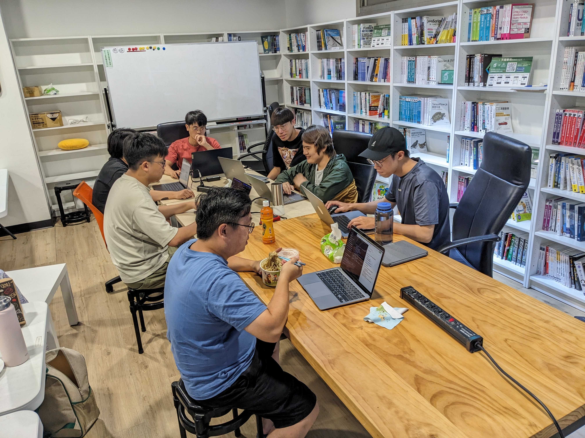

大家好，我是 結語 JYu，目前是一名後端工程師，同時也是好想工作室的小 Mentor。

好想工作室即將開始招收新一梯次的 Backend Camp 成員了😁

---

## 好想工作室？

好想工作室是一個在台南的資訊聚落，目前位在火車站旁邊，裡面有著很多對資訊科技充滿熱情的人。

有些人是工作者，也有些是學員，而學員分別隸屬於不同的 Camp。主要分成兩個 Camp：Web 和 Backend。

---

## 培訓的時間、地點？

地點是在好想工作室（廢話），地址是台南市東區北門路二段 16 號 L2A（台南文創園區內）

時間的話，大部分的學員都是在平日 9\~18 之間。

假日要來也是可以，但請先取得 Mentor 同意。

---

## 招生條件

- 自備乙台筆電，作業系統 Linux / Mac。

---

## Backend Camp 的培訓模式

### 一、自學

Backend Camp 是以自學為主，基本上 Mentor 會給你一個粗略的方向，或有時會有一些小作業。

這些都不是強制的，也不會押 Deadline 給學員。如果學員有自己想研究的方向，我們都是尊重，並盡量協助。

雖說如此，如果學員過於懶散，或是偏離後端領域太多，Mentor 還是會去關心一下喔😉

培訓過程中，不會有答案，也不會有很詳細的規劃。學員在每天、每個禮拜、每個月甚至到這半年想要達成什麼，都是仰賴學員自己做決定。

我們並不是放牛吃草，收進來就讓學員自生自滅。我們希望的是，學員有經過自己探索、消化並吸收後，並能試著歸納出自己的學習方向、方法、步調和目標等。

讓學員按表操課可能可以讓學員省去很多探索的時間，但只要不再有課程表，學員可能就不知道自己可以再朝什麼方向再進化了，這是我們不願意看到的。

畢竟對於軟體工程師來說，學習是一輩子的事情。

當然，如果有任何問題，不管是技術上、求職上甚至是心情上的問題，都可以找 Camp 的成員聊聊，聽聽大家想法，再做決定～

### 二、Camp 和學員共同進化

培訓這件事情不可能是完美的，畢竟每次學員的組成和程度都不同。

我們的培訓模式一定會有缺陷，但我們都會持續反思並和學員進行討論，最終目的就是要讓學員變得更好。

例如在第 10 梯的時候，我們有看到學員不太知道如何對某一個主題進行深入的研究，在「分享」這件事情上也比較缺乏架構，所以在第 11 梯的時候，開始了二到三週一次的後端分享會。在進行分享會的過程中，學員們也從一開始的東拼西湊、缺乏架構，變成井井有條並能緊扣主題。

此外，我們也發現一開始從業的軟體工程師可能在時間管理或目標設定上，會有一些困難。所以今年我們也特別設計了一個作業，模擬實際上會遇到的工作情況，如時程安排、需求確認。學員也從一開始根本不敢跟（假）業主確認需求，只看著規格書硬做，導致浪費時間。到後面能主動想到規格書上可能未盡的事項，也能對單一個需求提出多個解決方案，並跟（假）業主討論。詳情大家可以參考學員 Wade 以這個作業為主題撰寫的[鐵人賽文章](https://ithelp.ithome.com.tw/users/20157341/ironman/6645)。

說實話這些模式都沒有很創新，主要想講的就是：Backend Camp 的培訓模式，是會隨著學員的需求、上一屆學員的反饋和 Mentor & 小 Mentor 的經驗，而有所調整，並非是一成不變的。

當然，每次的調整我們都會和學員說明清楚目的和流程，並讓學員自己評估參與意願。

### 三、人行，必有我師焉

工作室鼓勵分享交流，並沒有侷限在資訊領域。

來到這邊的學員，過去的經歷五花八門。我當下稍微想一下，就有專案管理相關、自己創業開店、消防員、半導體工程師......等等。

除了經歷五花八門，「身分」也是很多元，大家各自都有各自的故事和經驗。

以我自己為例，我剛進工作室的時候，還是一個什麼都不知道的菜鳥大學畢業生。進到工作室之後跟大家交流，不僅了解到一些「社會經驗」，也開始對很多的行業有所理解。對我來說幫助很大。

說這麼多，我想引用前 Mentor Don 的一段話：

> Mentor 和學員的關係不是一種上對下的關係。
>
> 在我的學員當中，也有同時能夠成為我的 Mentor 的夥伴，也許我在技術方面可以成為他的 Mentor，而他在面對親情方面，也能夠成為我的 Mentor，我們互相扶持共同成長。

---

## Backend Camp 主要學習方向

### 技術面

- OS：Linux or MacOS

- 語言：PHP

- 框架：Laravel

- 資料庫：MySQL

- 雲端服務：AWS or GCP

以上都不是硬性規定，如果學員本人有想法或需求，都可以提出來討論。

### 軟實力

除了技術之外，我們也希望幫助學員培養：

- 分析問題、拆解問題、解決問題的能力

- 自學的能力

- 分享交流的能力

- 自省的能力

---

## 常見問題

1. 參加培訓需要學費或額外費用嗎？

   台南好想工作室 Backend Camp 6 個月培訓期間內免費。

2. 可以偶爾請假或提早走/晚點到嗎？

   可以，學員要對自己的學習全權負責。

   每個學員的背景都不同，有些可能有小孩、有些可能住很遠，這些都是學員自己需要考量和克服的。

   此外，我們很關心學員的身心健康，所以如果覺得壓力太大，也可以適當請假休息。

3. 因白天工作，有可能晚上或遠端培訓嗎？

   不行！時間是工作室希望學員付出的唯一要求，如果無法付出時間來工作室，建議可以先嘗試上線上課程。

4. 我很怕跟不上、六個月學不完怎麼辦？

   每個人的學習步調和模式都不同，但只要願意嘗試學習、提出來討論並調整，都是有機會漸臻佳境的。

   如果六個月之後，真的還想繼續留在工作室，可以跟 Mentor 申請成為「進駐學員」，Mentor 會評估你的狀況再進行決定。

5. 招募需通過篩選機制？

   對，因為好想工作室的資源有限，希望把資源給需要而適合的人。

6. 還有更多問題？

   好想工作室在某些禮拜四晚上會舉辦里民大會，歡迎來交流～

---

## 報名方式

報名分為兩個階段：

### 階段一：自我介紹、經驗分享

寄件信箱：
- SoJ：[sojphp@gmail.com](sojphp@gmail.com)
- 結語：[jk29666338@gmail.com](jk29666338@gmail.com)

麻煩以上兩個信箱都要寄～也可以用副本的方式

報名期限：即日起至 2023 年 10 月 12 日 23:59:59 止，因為空間有限，如果招募滿額也會停止繼續招生（如果停止招生會在此標示）。

撰寫主旨：「好想工作室 Backend Camp 申請」

內容格式：

1. 自我簡介 (現居 / 過去學 / 經歷等)。

2. 你認為自學的定義是什麼？你是否有自學的經驗？

3. 你對於「分享」的看法是什麼？是否有相關的經驗？

4. 描述你對於「軟體工程師」的看法

5. 為什麼想學習後端的技術？有學習過 web or mobile 的技術嗎？

6. 想來好想工作室的主要原因？

7. 回憶過去，感恩、生氣、沮喪的經驗各描述一件事。

### 階段二：面談

如果我們評估報名者有通過第一階段後，就會邀請報名者來好想工作室，進行一個 1 \~ 2 小時不等的面談。

在面談中，我們除了會針對第一階段的問題做延伸討論，也會確認一下報名者的價值觀適不適合 Camp。

面談並不是考試，過程中也許會出現技術，但都是偏向於討論。就當作一般的閒聊，不用特地準備什麼東西。

如果真的說要準備什麼，可能可以在面談前，先想清楚自己走這條路的目標是什麼。