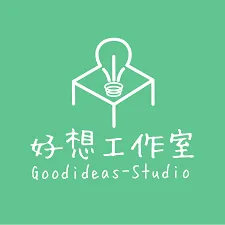
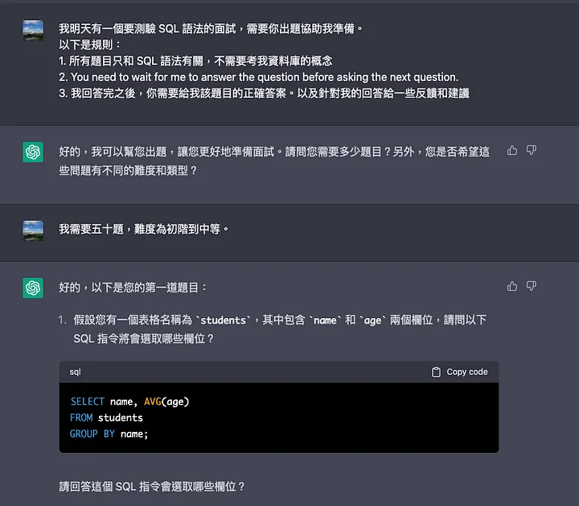

（本文同步更新在 [vocus](https://vocus.cc/article/64282945fd89780001119de4) 和 [medium](https://jyu1999.medium.com/%E5%A5%BD%E6%83%B3%E5%B7%A5%E4%BD%9C%E5%AE%A4-%E5%BE%8C%E7%AB%AF-backend-camp-%E5%9F%B9%E8%A8%93%E5%BF%83%E5%BE%97-%E4%B8%80-%E5%A5%BD%E6%83%B3%E5%B7%A5%E4%BD%9C%E5%AE%A4%E7%B0%A1%E4%BB%8B-e484bb7993f2) 上）

## 前言
嗨大家好，我是結語 JYu。

開始撰寫這個系列的時間是 2023 四月，也是我在好想工作室 backend camp 培訓的倒數一個月，想說可以分享一些心得，給對轉職為後端工程師的人參考。

➡️[【好想工作室 — 後端 (backend Camp)培訓心得（一）：好想工作室簡介】](https://jyu1999.com/post/goodidea-mind-1/)：簡單介紹好想工作室。

[【好想工作室 — 後端 (backend Camp)培訓心得（二）：backend camp 在幹嘛】](https://jyu1999.com/post/goodidea-mind-2/)：會講後端培訓的點點滴滴。

[【好想工作室 — 後端 (backend Camp)培訓心得（三）：我好想進來好想】](https://jyu1999.com/post/goodidea-mind-3/)：會給想進 backend camp 的一些建議。

[【好想工作室 — 後端 (backend Camp)培訓心得（四）：我快崩潰了，怎麼辦？】](https://jyu1999.com/post/goodidea-mind-4/)：會講學員的心態管理。

[【好想工作室 — 後端 (backend Camp)培訓心得（五）：這麼多東西，要怎麼學最有效率？】](https://jyu1999.com/post/goodidea-mind-5/)：會講學員的學習技巧。

【好想工作室 — 後端 (backend Camp)培訓心得（六）：我好想要錢（找工作）】：會講我自己的求職心得。等我找到工作後（應該會）再寫

本系列文章純以我的觀察和想法為出發點，不一定就是實際狀況，也不帶任何批判。

如果覺得資訊對你有用的話，不妨按下方拍手鼓勵一下我喔！

然後我都是想到什麼就寫什麼，難免會有沒有提及到的，如果你有任何疑問，歡迎寄信至 jk29666338@gmail.com 來詢問我。

好，廢話都講完了，那就讓我們開始吧！

---

## 好想工作室？

如果你是透過搜尋而找到這篇文章，想必你早已知道好想工作室在幹嘛了，但這裡我還是快速說明一下。

好想工作室是一個「資訊聚落」，目前位於台南火車站旁。

裡面主要存在三種人，一種是「進駐者」，意指那些有著**全職資訊相關工作**的人。他們**付費**租借了一個工作室的位置，在工作室裡面工作。

第二種人是「學員」，學員是指那些**想要成為軟體工程師**，正在**全職進行培訓**的人。

第三種是「mentor」，就是**引導學員學習**的天使們XD

這樣說的話，好想工作室有點類似一個，co-working space 和 教育機構的綜合體，不過只限定資訊領域，因此，我才會說他是一個「資訊聚落」。

---

## 軟體工程師培訓？

好想工作室非常佛心的提供了**免費**的軟體工程師培訓，根據專業不同，分為四個 camp：

- 前端：主要負責一個網頁中你看得到的部分。
- 後端：主要負責一個網頁的後台。
- Android：寫 android 手機的 app
- IOS：寫 IOS 系統的 app

每次培訓會是**六個月**，在這六個月的期間完全免費。在這六個月當中你必須在好想工作室裡面**全職自學**。

但資訊領域博大精深，如果六個月學不完也不用擔心，如果學習態度良好，可以跟 mentor 討論成為「付費學員」，繼續在好想工作室學習。

---

## 自學？

初來乍到的人也許會想：「我看其他的培訓營都有課綱、都有老師上課，自學真的學的會嗎？」

其實我從小到大的學習歷程就很討厭一句話：

> 你就先學，總有一天你會用到的。

在現代社會中，我們光是學「會用到的東西」，就算拼進全力也未必學的完了，更何況是去學「總有一天」會用到的東西。

而自學的好處就在此，沒人告訴你要學什麼，也意味著你能挑真正對你有用的東西來學。

沒有老師上課，在網路世界早已不是一個理由。除非領域真的特別偏門或新穎，不然以軟體工程師來說，youtube 隨便一個程式語言，可能就有幾百個課程，等於你實質上有幾百個老師可以教你。

如果你需要作業，也有人針對語言設計了互動式的網頁和題目可以給你練習，甚至你可以直接請 chatgpt 幫忙出作業。

可能又有人會問：「那我怎麼知道哪些東西重要？」

但我認為「找重點」的能力本來就是一個軟體工程師必備的技能。就像我們寫程式 debug 的時候會需要分析錯誤，再設法解決。對自己也是一樣，身為軟體工程師，我們也要時時刻刻分析自己，看見自己的不足，而這些「不足」就是我們需要學習的重點。

至於要怎麼分析？要怎麼針對自己的不足逐一改善？我在後面的文章也許會提。

總而言之，自學是一個軟體工程師的必備技能，而如果能在工作前就能鍛鍊這個技能，不香嗎？

---

## 我怎麼會在好想工作室？

因為我的背景也和之後培訓的過程息息相關，因此在這裡我想先提我是怎麼入教的。

2022 年我大學畢業之後，想找後端工程師的工作。但由於我不是純資訊科系出生的，在學校只有修過少少、不到三十學分資工系的課。於是我便告訴自己，要利用畢業後這一年，好好學習後端相關技能。

一開始我是在 udemy 找課程，學習全端。但學沒多久我就發現效果不佳，不是因為內容太難我不會，而是缺乏別人可以討論和交流。當時的我對前後端都一無所知，也還不知道網路上大概有哪些資源可以善用。

於是我開始尋找資訊培訓的機會，一開始是找到台北的 Appworks School，但沒有錄取。後來在入伍前一個禮拜，我赫然發現台南也有人在做資訊培訓，身為台南人的我狂喜。但猛一看早已超過報名期限。

軍中的五天，我思索之後決定嘗試直接到好想工作室成為「進駐者」，等於是把好想工作室當 K 書中心的概念XD

實際跟工作室的人見面之後，她告訴我要成為進駐者必須要有資訊相關工作，建議我可以先從學員開始，並鼓勵我寄信去問問看 mentor。

後來我跟 mentor 聊過之後，他認為我三觀還算端正，也算願意學習，就讓我加入了 backend camp。

於是，我比後端 camp 的其他成員晚一個月開始培訓，也要比大家晚一個月走QQ

培訓的辛酸血淚史也從這邊開始了…

---

下一篇：[【好想工作室 — 後端 (backend Camp)培訓心得（二）：backend camp 在幹嘛】](https://jyu1999.com/post/goodidea-mind-2/)：會講後端培訓的點點滴滴。