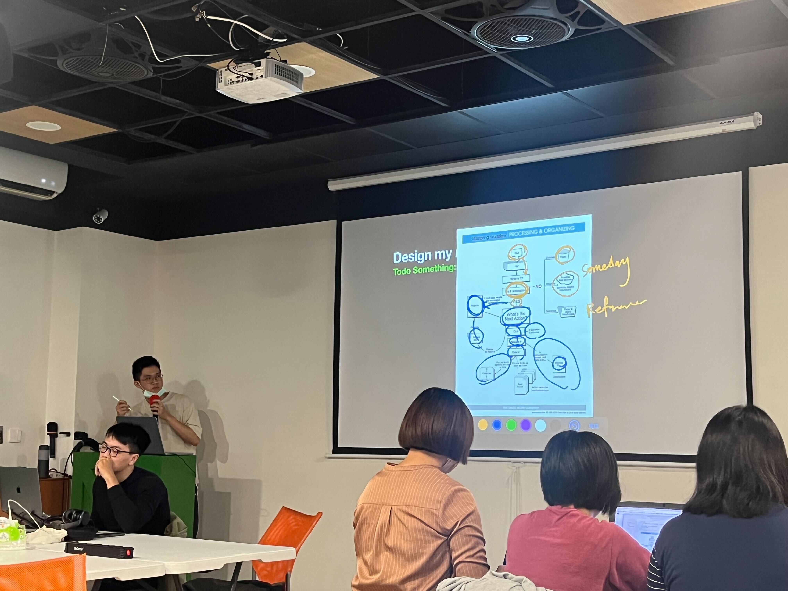

（本文同步更新在 [vocus](https://vocus.cc/article/64284d7ffd89780001130f8b) 和 [medium](https://jyu1999.medium.com/好想工作室-後端-backend-camp-培訓心得-二-backend-camp-在幹嘛-65e930feac71) 上）

嗨大家好，我是結語 JYu。

開始撰寫這個系列的時間是 2023 四月，也是我在好想工作室 backend camp 培訓的倒數一個月，想說可以分享一些心得，給對轉職為後端工程師的人參考。

[【好想工作室 — 後端 (backend Camp)培訓心得（一）：好想工作室簡介】](https://jyu1999.com/post/goodidea-mind-1/)：簡單介紹好想工作室。

➡️[【好想工作室 — 後端 (backend Camp)培訓心得（二）：backend camp 在幹嘛】](https://jyu1999.com/post/goodidea-mind-2/)：會講後端培訓的點點滴滴。

[【好想工作室 — 後端 (backend Camp)培訓心得（三）：我好想進來好想】](https://jyu1999.com/post/goodidea-mind-3/)：會給想進 backend camp 的一些建議。

[【好想工作室 — 後端 (backend Camp)培訓心得（四）：我快崩潰了，怎麼辦？】](https://jyu1999.com/post/goodidea-mind-4/)：會講學員的心態管理。

[【好想工作室 — 後端 (backend Camp)培訓心得（五）：這麼多東西，要怎麼學最有效率？】](https://jyu1999.com/post/goodidea-mind-5/)：會講學員的學習技巧。

【好想工作室 — 後端 (backend Camp)培訓心得（六）：我好想要錢（找工作）】：會講我自己的求職心得。等我找到工作後（應該會）再寫

本系列文章純以我的觀察和想法為出發點，不一定就是實際狀況，也不帶任何批判。

如果覺得資訊對你有用的話，不妨按下方拍手鼓勵一下我喔！

然後我都是想到什麼就寫什麼，難免會有沒有提及到的，如果你有任何疑問，歡迎寄信至 jk29666338@gmail.com 來詢問我。

好，廢話都講完了，那就讓我們開始吧！

---

## 我的夥伴們

進到工作室後，首抽就是跟你同 camp 的戰友。

可別小看這群夥伴，在你解一個 bug 解一天還解不出來、做一個作業做一個月還做不完的時候，有人陪你一起耍蠢(X) 試錯(O) 其實是很重要的事情。

在我們這屆，成員橫跨 20 出頭歲的菜鳥大學生，到 40 幾歲小孩已經上國中的父親。這些人不約而同的聚集在這裡，目的都只有一個：成為後端工程師。這就是所謂的共時性（X

這群戰友們或多或少都有受過社會的洗禮，知道自己要的是什麼。而且可以很明顯的感覺到，有些人是抱持著「這是我人生中最後一次任性的決定」而出現在這裡的。

不像高中大學的學生，眼前還有很多道路去給他們慢慢探索。這些人的目標非常純粹，因此，做起事來就是**不遺餘力**。常常看到有人半夜、假日還在線上，在解決程式問題。

我一直都很佩服我這些同儕們，也從他們身上學到很多東西。雖然這樣講有點肉麻，但能跟他們一起培訓，真的是我這六個月覺得最幸運也最幸福的事情。（寫到這邊突然開始眼框泛淚…

---

## 我的 mentor

SoJ 大大是目前後端的 mentor，SoJ 其實不常出現在工作室，但也是 Backend Camp 的靈魂人物之一。

首先說說他的管理風格好了，基本上是什麼都不管。這六個月我有印象的只有三個作業吧。他本人出現的次數也是很少。

說他什麼都不管其實不是在臭他，他也不是真的對我們漠不關心。相反，無論我們問他什麼，他總是用最快的速度回答，而且有問必答，不厭其煩。

我非常非常喜歡他的管理風格，我認為這樣才是**真正符合自學的精神**。據我所知其他 camp 的規定就稍微比較嚴格，作業也相對多，非常的不適合我。

---

## 培訓的日子怎麼過的？從微觀到巨觀

我想要用 天 → 週 → 月 的順序，來說說我的後端培訓之旅。

### 天

基本上每天早上八點到十點半之間要進到工作室，下午五點到八點之間離開。能待多久，全看個人狀況決定，mentor 主要會看你的**學習成果**來判斷你是否認真學習，而不是時數。

當然也是不建議特立獨行，什麼半夜來中午走之類的。我個人在前期通常都會在 10 點多到，後期因為睡覺時間開始不受控制，有時候會看日出…所以可能 11 點多才會到。我通常是在晚上六七點走。

每天到這邊之後就是打開電腦，自己想一下現在要學什麼，就開始進行。如果真的很悶，也可以起來**看看其他同儕在幹嘛**，請他們跟你分享，彼此交流意見。這個方法除了可以讓你很快跟別人混熟之外，因為每個人研究的面向都不一樣，你或許能從其他人的學習之中，得到一些新的靈感或想法。

真的遇到問題，可以去找進駐者、mentor 或和同儕討論都可以。我自己蠻**推薦大家先跟同儕討論**的，就算同儕不會，至少你們能一起找尋資料，這個過程其實也可以讓你觀察其他人是怎麼解決問題的，然後設法把好的學習起來。直接找進駐者或 mentor 的話當然也可以，但是你就少了「找尋答案」的過程，我認為會比較可惜。

因此，我自己的判斷基準是，如果一個 bug 卡了超過半小時，然後同儕討論都無解，我才會去問 mentor。

同樣，如果你的同儕來問你問題，我個人建議**完全不要藏私**，也不要因為忙就推辭掉，因為這是一個很好的學習機會。

著名的諾貝爾物理學獎得主 Richard Feynman 曾說過：

> 如果你不能向其他人簡單地解釋一件事，那麼你就是還沒有真正弄懂它。

當其他人來問你問題的時候，你可以試著解釋你的理解。然後你就會驚奇的發現，在解釋的過程中，你其實有些地方講的並不清楚，就**更知道自己哪裡需要加強**。

為什麼我會這麼清楚這件事情呢？因為我畢竟算有資訊背景，比其他人提早開始寫程式，對於程式的理解也比較深。所以在前四個月大家研究的東西還差不多的時候，大家有問題都會來問我。

其實如果可以的話，最好要能「主動分享」，你可以在聊天室裡面說你今天學了什麼，試著跟大家解釋你的所學。如果主題較多的話，你也可以直接召開會議。像我就有做簡報跟後端的學員講解物件導向、演算法、時間複雜度等等。

### 週

每週一到五都是要出現的，當然臨時有事可以跟 mentor 請假。

六日的話，想來也可以來。

每週四會有一個活動「想知道嗎？」，開放工作室所有人，可以上台做一些分享，內容不拘。也沒有強迫觀眾一定要聽，反正不想聽的耳機掛著做自己的事情就好。

說到每週固定活動，我自己有參與一個「Javascript 讀書會」。

這個讀書會的起源也蠻奇妙的，就是一個某一位前端培訓（Frontend Camp）的成員一起被安排去倒垃圾，無意間她跟我提到的。我一聽就覺得蠻有興趣的，畢竟 JS 算是這幾天最火熱的語言沒有之一。

讀書會的形式也類似於想知道嗎，反正就是挑自己有興趣的 JS 主題進行分享，如果有什麼專案也可以拿出來講。在這個過程中，也可以聽到前端是怎麼思考的，我自己是受益良多。

所以我也蠻鼓勵大家不只是認識自己 camp 的成員們，也多去跟其他 camp 的人聊聊天，認識一下，甚至一起做事。畢竟後端以後大概率就是會需要跟前端合作嘛XD

### 月

[上一篇文章](https://jyu1999.com/post/goodidea-mind-1/)有提到，我比其他 camp 成員慢一個月進來。

據他們所說，他們那個月基本上都在練英文打字、學習安裝環境和版本管理。

打字速度對於工程師來說頗重要的，不只是在寫程式，有時候下一些指令、去網路上找資料也是要用英文找。我們主要是使用 [ratatype](https://www.ratatype.com/typing-test/test/) 來練習，有興趣的可以去測一下自己的英打速度XD

不過我的狀況算比較特殊，我英打本來就比較快，正常打文章就有 5X/wpm，如果是寫程式的話更快。安裝環境我是在進去之前，mentor 就告訴我可以先裝，所以我在週末就先裝好了。而版本管理也是之前在學校有稍微用過。

再來第二個月會開始學習後端程式語言的語法，我們是使用 PHP。除此之外也會接觸到用來操作資料庫的語法 SQL。

在這邊就是痛苦的開始了，你會遇到數不清的 bug，和想破頭都想不出來的問題。

其實後面在學什麼已經沒這麼重要了，因為隨著大家摸索的愈來愈多，想學的東西也會逐漸出現分歧。

所以在這裡我想來著重提一個概念：解決問題。

---

## 解決問題

> 培訓六個月，不會讓你變成強者，但至少會讓你能「解決問題」。

這是我在面試 backend camp 的時候，SoJ 跟我說的話。

而我也非常認同。

六個月的期間，從一開始，你的 bug 會多到根本不知道從何問起，不懂的地方就算別人講完你可能也聽不懂。

到後來，你開始會慢慢可以組織問題，至少知道要怎麼樣去問別人。這時候別人有可能會給你一個非常重要的東西：「關鍵字」。

接著，隨著你的「關鍵字」愈來愈多，你開始能自己上網 google 找到解答。但你卻不一定看得懂。

之後，你開始能看懂解答到底在說什麼，你也有能力把問題描述清楚了。

最後，也是最理想的狀態：當你遇到一個問題時，你能做出多種不同的推論。並把這些推論拆解成一個一個關鍵字，然後利用這些關鍵字上網搜尋，很快的找到答案並解決問題。

當你到達最後一個階段的時候，我個人認為你已經可以說自己是一個 junior 的後端工程師了。

「解決問題」事實上非常難以量化，卻是一個工程師最基礎的能力。

「解決問題」聽起來也非常簡單，背後卻需要很多很多的努力。

為了要解決問題，你必須要有足夠的基礎知識，否則根本不知道如何下關鍵字，也不知道錯在哪。

為了要解決問題，你必須要有一定的英文閱讀能力，才不會 error message 看不懂，網路文章也看不懂。

為了要解決問題，你必須要善用工具，無論是 chatgpt，或是其他的偵錯工具，幫助你知道問題在哪裡。

為了要解決問題，你必須要會拆解問題，有些問題範圍太大、環環相扣，是難以找到解答的。

為了要解決問題，你必須要放下面子，有時候趕快承認自己不會，不齒下問，會幫助你省下很多時間。

---

## 學習是快樂的

最後，我想在這裡特別提這件事情。

或許是台灣的教育環境所導致吧，我們說「學習」常常就會想到挑燈夜戰或懸樑刺股之類的成語，好像學習是一件非常刻苦的事情。

工作室有些人也是抱持著這樣的想法，為了學寫程式，拋棄了生活中很多東西，想辦法把全部時間都投資在寫程式上面。

我自己是對這些人感到佩服，但除非走投無路，不然我絕對不會採取這樣的作法。

學習，尤其是對於軟體工程師來說，是一輩子的事情。而一件事要做一輩子，你要熱愛這件事情，也要能 Strike the balance between work and play。

不僅如果你總是把自己逼的很緊，學習的效率會不好，而且當你遇到困難時，你有很大的機率會堅持不住。

在寫程式這條路上，我有好幾次就是在電腦前從早坐到晚，從禮拜一坐到禮拜天，解不出來就是解不出來。然後就會開始想要放棄、開始擺爛。

當然，我也不是鼓勵大家隨便學學。你還是要保有基本的學習態度，但在學程式之餘也別忘了多享受一下生活喔 : )

如果對心態管理有興趣的，我會在[第四篇](https://jyu1999.com/post/goodidea-mind-4/)的時候提及。

---

下一篇：[【好想工作室 — 後端 (backend Camp)培訓心得（三）：我好想進來好想】](https://jyu1999.com/post/goodidea-mind-3/)：會給想進 backend camp 的一些建議。
