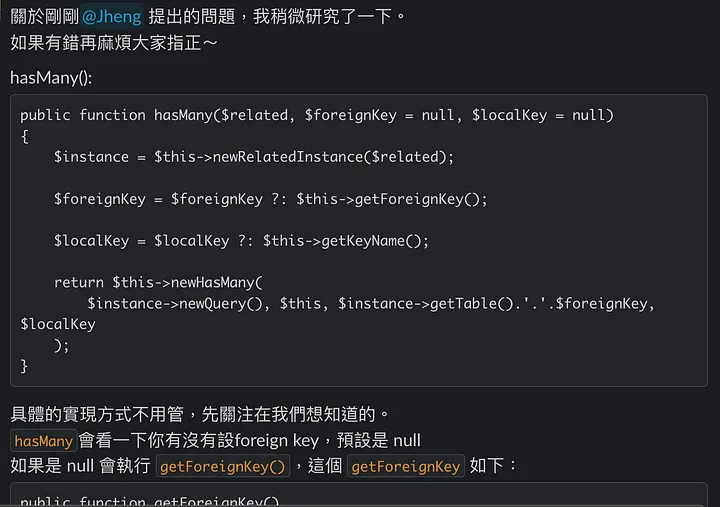

（本文同步更新在 [vocus](https://vocus.cc/article/64285300fd8978000113457b) 和 [medium](https://jyu1999.medium.com/好想工作室-後端-backend-camp-培訓心得-五-這麼多東西-要怎麼學最有效率-c1aafaa7939) 上）

嗨大家好，我是結語 JYu。

開始撰寫這個系列的時間是 2023 四月，也是我在好想工作室 backend camp 培訓的倒數一個月，想說可以分享一些心得，給對轉職為後端工程師的人參考。

[【好想工作室 — 後端 (backend Camp)培訓心得（一）：好想工作室簡介】](https://jyu1999.com/post/goodidea-mind-1/)：簡單介紹好想工作室。

[【好想工作室 — 後端 (backend Camp)培訓心得（二）：backend camp 在幹嘛】](https://jyu1999.com/post/goodidea-mind-2/)：會講後端培訓的點點滴滴。

[【好想工作室 — 後端 (backend Camp)培訓心得（三）：我好想進來好想】](https://jyu1999.com/post/goodidea-mind-3/)：會給想進 backend camp 的一些建議。

[【好想工作室 — 後端 (backend Camp)培訓心得（四）：我快崩潰了，怎麼辦？】](https://jyu1999.com/post/goodidea-mind-4/)：會講學員的心態管理。

➡️[【好想工作室 — 後端 (backend Camp)培訓心得（五）：這麼多東西，要怎麼學最有效率？】](https://jyu1999.com/post/goodidea-mind-5/)：會講學員的學習技巧。

【好想工作室 — 後端 (backend Camp)培訓心得（六）：我好想要錢（找工作）】：會講我自己的求職心得。等我找到工作後（應該會）再寫

本系列文章純以我的觀察和想法為出發點，不一定就是實際狀況，也不帶任何批判。

如果覺得資訊對你有用的話，不妨按下方拍手鼓勵一下我喔！

然後我都是想到什麼就寫什麼，難免會有沒有提及到的，如果你有任何疑問，歡迎寄信至 jk29666338@gmail.com 來詢問我。

好，廢話都講完了，那就讓我們開始吧！

---

## 前言

每個人可能都有自己學習的模式，但如果你初來乍到，你可能對如何學習後端技術或語言會感到很困惑。

在這裡我提出我自己學習的方式，供初學者參考。

當然還是建議大家要多多探索，找尋自己學後端最舒服的姿勢。

---

## 基礎知識和用法的 tradeoff

如果你有看過我前面四篇文章的話，應該不難發現我非常強調「基礎知識」。

什麼是基礎知識？我個人認為所謂基礎知識就是那些**無論工具、語言怎麼換，都放諸四海皆準的東西**。

例如，在網站框架有一個重要的概念叫做 MVC 架構，這個 MVC 架構在各個後端語言框架都通用，只是有時候名字和實作方式會略有不同而已。 因此，MVC 架構就是屬於基礎知識，而特定語言如何實作 MVC 架構就不是基礎知識。

同理，對於後端來說，網路知識（HTTP, IP, TCP/UDP…）、基礎資結演算法（時間複雜度、BFS、DFS…）、sql 原理（B+ Tree, 正規化…）、Linux OS、git 等等都算是基礎知識。

但聰明的你應該不難想到，如果要把基礎知識都學完，才開始學習實際應用，顯然是不切實際的。可能從你兒子剛會叫爸爸，到你孫子已經成為後端工程師，你都還沒成功轉職。

沒有公司會要一個只有概念，但沒辦法透過實作來顯示自己有概念的工程師的。

所以要怎麼辦？完全不管基礎知識嗎？

### 如果你正在學習，不要專注在解決問題本身

是的，你沒看錯。

我其實**不鼓勵大家隨機挑選基礎知識來學習**，因為這樣顯然違背了我[第一篇文章](https://jyu1999.com/post/goodidea-mind-1/)所提到，自學的精髓之一：挑真正對你有用的東西來學。

什麼意思？上面不是說基礎知識放諸四海皆準嗎？怎麼這裡又說基礎知識對我沒用了？

沒錯，基礎知識是具有「通用性」，但卻不代表它「會用到」。

假設你研究演算法研究的非常深入，把各種奇形怪狀、偏門的演算法研究透徹，但現實是，一般企業根本就不會用到這麼多演算法。

所以最好學習基礎知識的情境有兩個：

- ***你正在研究用法***：你可能學到框架裡面有一個好用的 function 可以 call，這時候最好了解一下其底層是怎麼實作的。另一種可能是你用到語言中幫你啟好的 development server (e.g. laravel 裡面的 `php artisan serve`)，那你最好也去了解一下怎麼自己架 server。
- ***你遇到 bug***：基本上你看到 bug 就要特別小心了，除非你是純粹失誤，不然有可能就是你基礎知識不熟。像 Laravel 裡面的 model，預設不允許 mass assignment，為什麼？或是 Laravel 的表單需要放入一個 CSRF Token，為什麼？如果是為了安全性，那有沒有其他方式能增加安全性？

簡單來說，**在實作或除錯的過程中，稍微解析一下問題，多去思考其原理**，然後保持好奇，看有沒有其他作法能達到相同的效果。不要急著把問題解掉就直接下一步了。

### 知道去哪裡查用法就好

初學者常常會把所有的用法都寫在自己的筆記裡面，但我自己覺得沒有必要。

一來很花時間，不僅需要紀錄，也需要整理。有時候要找的時候也未必找的到。

二來有些用法可能會隨著版本迭代而有所不同。

所以我推薦大家真的要記筆記的話，記「關鍵字」就好。假如你在學習 PHP 物件導向，那你筆記裡面只需要記下 Access Modifiers, Inheritance, Traits 等等關鍵字，然後記下可能會有答案的網站。這樣其實就夠了。

### 如何判斷要不要繼續往下挖？

假設你按照我上面的方法，可能你有一天會遇到一個 bug，**這個 bug 牽扯到的基本知識超級多**，涵蓋作業系統、語言特定、web server 架設等等。等於你解這個 bug 並學習背後的基礎原理，可能一個月就不見了。

在這裡我的建議和上一篇文章判斷前輩的建議的方式一樣，就是要「深入了解建議/題目的內容以及用意」。

也就是說，你可以看看類似的 bug 你是不是碰到好幾次了？如果已經碰到好幾次那可能真的是你有所欠缺，就趕快補上吧！

但如果你跟這個 bug 才初次見面，剛玩完破冰遊戲，彼此還不熟悉的狀況，那你可以稍微評估一下背後原理是否會需要花很多時間了解，如果需要很多時間的話就先略過吧！

---

## 爭議題：該不該跟著教學影片實作？

曾經我有跟某位後端學員討論過這個問題，在這裡直接說我的答案吧：**要，也不要**。

通常會遇到這個問題是長時間的影片實作，畢竟影片如果不到五分鐘，你做不做根本沒差。

遇到這種影片，我通常就會看兩次。不過我**第一次一定是不會跟著實作**的。

原因有二：

- ***影片內容未必對我有用***：影片就是這樣，如果不是全部看完很難確認到底會不會學到自己想學的東西。如果我花費大量時間跟著實作，到一半才發現影片內容根本不符合我預期，不是很虧ㄇ
- ***專心在理解***：邊看影片邊做，有時候會讓人沒辦法去理解作者為什麼要這樣做，或聽清楚作者到底講了什麼，因為光是要跟上作者的打字速度就要卯足全力了。相反，如果完全不實作，就能把 100% 心力放在作者到底講了什麼，為什麼要這樣做。

第二次看影片的時候，我就會跟著作者實作，看實作起來會不會有什麼問題。甚至第一次看的夠清楚的話，搞不好也可以試著自己從頭開始做做看，如果遇到 bug 再回去看作者怎麼做，學習效果更佳！

---

## 你就跟我們講一下嘛

最後，還是要提一下[第二篇](https://jyu1999.com/post/goodidea-mind-2/)有提到的「主動分享」。

比如說，我有時候會在 slack 跟同儕們分享剛剛的新發現。在撰寫的時候，我就會發現有些地方我講的並不是這麼順，我就會再額外去找資料，增強我自己的理解。

不只是這樣，在 slack 丟出來，看到你分享的人，可能會額外提出一些疑問，這時候你不就又有新的東西可以研究嗎！

也不用特別害怕講錯，反正你只是分享自己的理解，也沒有強迫灌輸別人你是正確的。況且，mentor 通常也會看到你的分享，如果真的有錯他（可能）也會幫你矯正一下，所以就大膽分享吧～

> 謎之音：常常分享 mentor 就會覺得你比較認真？

也不只是所學可以丟出來，我也鼓勵**把一些 bug 丟出來討論**。

但當然不是每次遇到 bug，就直接把 error message 丟到群組啦。這樣真的太北爛了，小心被霸凌（X

如果你要丟 bug 到群組討論，最好是附上以下敘述：

- 你現在想做什麼功能？
- error message 是什麼？
- 你個人的推論是什麼？
- 你試過哪些解決方法？試了之後 error message 有沒有變？

為什麼要附上以上敘述，除了更**方便別人 debug** 之外，也才有**「討論」**的空間。

比如說，mentor 發現你的推論很不合理，正常遇到這個狀況會是 C 出問題，而你卻說可能是 A or B 出問題，mentor 就能給你反饋。

又比如說，你查詢到的解答很奇怪，根本不是解決這個問題所需要的。那很可能就是你欠缺的是「關鍵字」或「google 能力」，其他人就可以針對這個問題提出他們認為合理的關鍵字。

總而言之，如果可以的話就多多分享吧！也要記得，你分享的目的只是**為了讓自己變得更好**，而不是真的要教給別人什麼，所以**不用害怕說錯什麼**～

---

本篇分享了我認為身為後端學員，有效率的一些學習方式。如果有想到其他的我再補（有時間的話）。

其實都蠻樸實無華的，畢竟學習本來就不會有捷徑，只有 chatgpt（X

當然，如果你是現役或已畢業後端學員，歡迎跟我分享你親測有效的學習方式！

