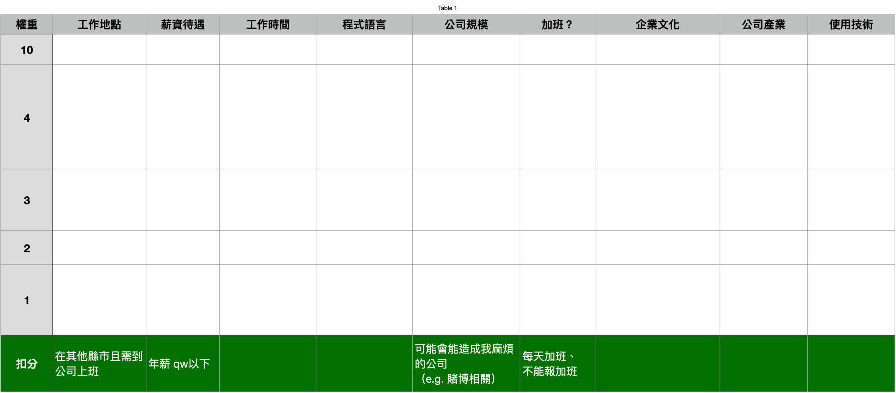

嗨大家好，我是結語 JYu。

開始撰寫這個系列的時間是 2023 四月，也是我在好想工作室 backend camp 培訓的倒數一個月，想說可以分享一些心得，給對轉職為後端工程師的人參考。

[【好想工作室 — 後端 (backend Camp)培訓心得（一）：好想工作室簡介】](https://jyu1999.com/post/goodidea-mind-1/)：簡單介紹好想工作室。

[【好想工作室 — 後端 (backend Camp)培訓心得（二）：backend camp 在幹嘛】](https://jyu1999.com/post/goodidea-mind-2/)：會講後端培訓的點點滴滴。

[【好想工作室 — 後端 (backend Camp)培訓心得（三）：我好想進來好想】](https://jyu1999.com/post/goodidea-mind-3/)：會給想進 backend camp 的一些建議。

[【好想工作室 — 後端 (backend Camp)培訓心得（四）：我快崩潰了，怎麼辦？】](https://jyu1999.com/post/goodidea-mind-4/)：會講學員的心態管理。

[【好想工作室 — 後端 (backend Camp)培訓心得（五）：這麼多東西，要怎麼學最有效率？】](https://jyu1999.com/post/goodidea-mind-5/)：會講學員的學習技巧。

➡️[【好想工作室 — 後端 (backend Camp)培訓心得（六）：找工作之前】](https://jyu1999.com/post/goodidea-mind-6/)：會講我自己的求職心得。

本系列文章純以我的觀察和想法為出發點，不一定就是實際狀況，也不帶任何批判。

如果覺得資訊對你有用的話，不妨按下方拍手鼓勵一下我喔！

然後我都是想到什麼就寫什麼，難免會有沒有提及到的，如果你有任何疑問，歡迎寄信至 jk29666338@gmail.com 來詢問我。

好，廢話都講完了，那就讓我們開始吧！

---

## 前言

在開始前，我想要先講一些廢話XD。

> 找到工作不是終點。

每個人進到工作室培訓的理由都不太一樣，我自己前期和後期的目標也略有不同。但基本上在工作室當學員的人，都是為了要「成為」軟體工程師。

看起來以這個目的來說，不管是找到工作，或是純接案，已經是屬於尾聲了。但我認為找到工作僅僅代表從「好想工作室的學員」畢業，開始工作之後，先不論是否要朝 senior 邁進，一定都會感受到自己的不足，還有很多很多需要學習的東西。

所以，其實找到工作後，仍然會是學員；又抑或說是，無論是多強的軟體工程師，都一定有可以再更精進的東西。

但差別是，此時再學東西，就會更知道為何而學，也更有動力。

至少就我個人而已，找到工作後的學習動力 > 在好想當學員的學習動力 >>>>>> 在學校的學習動力。

這也和我暫時不讀研究所的原因有關，不過這又是別的話題了XD

我會在這兩篇，分享一下我在工作室培訓時，我對「找工作」這件事情的想法轉變。以及我找工作的過程中，做了什麼？又有哪些收穫和反思。

---

## 想法轉變的過程 

> 這一個段落是關於我個人的故事，不想看可以直接跳過~

我在[第一篇](https://jyu1999.com/post/goodidea-mind-1/)說過，我剛開始的心態就是要趁著大學畢業後的一兩年好好充實自己，讓自己有能力去找後端工程師的工作。

所以其實剛進好想的時候，我也是規劃八到九個月來專心進行培訓，先不想著找工作。

後來剛好在某次的聚會上，有一位後端的學長提到他們公司最近有徵人的計畫，此時大概是 1 月，也就是我進好想的第三個月。

但這時我其實也沒有特別覺得怎樣，就只是聽過這個消息，覺得如果心有餘力可以試試看而已。

後來有一個晚上，我收到我哥的訊息，說父母因為工作的原因而大吵了一架。

其實以我父母現在的狀況，他們大可以選擇退休，而不是辛苦的硬撐，尤其是在身體有狀況的前提下。

而雖然他們沒有明說，也或許不是這樣，但我內心就產生一股自責感：「就是因為我到現在還沒工作，讓他們沒辦法安心退休」。

這股自責感讓我那段時間幾乎每個晚上都睡不好覺，都一直在想這件事情。

正如我某位朋友跟我說的：「因為你太有想法，別人怎麼說其實你都不會感到壓力；你的壓力都是自己給自己的。」

而在失眠了一個禮拜之後，我覺得必須得做出改變，不然身體真的快受不了了。

於是我決定提前開始我的求職計畫。

---

## 一開始的求職

一開始我沒有採取很積極的作為，只是去問了後端的學長說徵人的消息，然後很順利就進到面試流程。

在寫筆試題的時候我發現，求職狀態某種程度來說是會跟學員身分衝突的，因為會需要投資大量時間在筆試題上面，而沒辦法專心學原本在學的東西。

於是大概寫了幾天，我就轉變策略，變成全心全意求職。

我也建議大家這樣做，而且最好是一次投 10~15 間公司，然後稍微控制收到結果的時間。這樣比較有助於你跟公司談薪水和做決定。

我個人最後是花了兩個多月才確定找到工作，總共投了 13 間，有四間面試，兩間 offer。

---

## 你想要什麼？

我認為在求職的最初期，先想好自己找工作的條件，是非常重要的一件事情。尤其對於社會經驗還不豐富的人（像我），我更建議要把條件一一列出。

不管跟技術主管、人資談話的時候，他們總會有一些方式來包裝自己的公司。我並不反對他們這樣做，但有時候這些包裝會容易讓求職者被影響。

比如說，接案公司可能會說自己是在做「客製化系統」、「協助企業做數位轉型」之類的。但如果求職者是想要有自己的產品或服務的公司，可能就比較不適合。

此外，列出條件也有助於求職者快速篩選公司，避免浪費時間。

可以看到我最重視的事情就是遠端工作，所以我甚至在寫筆試題之前就會先問能不能遠端，可以省下很多時間。

### 條件不會從一而終

基本上，條件是需要做彈性調整的，隨著你面試愈多家，會更知道自己的條件是否合理，且是否要新增/刪除一些內容。

比如說我在面某家有自己的產品的公司時，技術主管跟我說，公司目前是用很舊版本的框架，所以需要對語言很熟悉。此外，js 的部分也不是用框架寫，原因是因為這樣要付出額外的學習成本。

這跟我自己的求職期許就不太合，我會希望公司在考量獲利的同時，也積極升級版本、試著採用其他的工具。所以後續面試我都會特別問有關於版本的問題。

---

## 履歷寫清楚就好

有些人可能會鼓勵履歷用 PS/AI 做，但我個人覺得以工程師而言，履歷寫的簡單清楚即可。最好不要超過兩頁，也不要放什麼 skills 量表。

至於要不要為了特定公司做履歷客製化，我自己是覺得不需要。

因為假設一位零基礎的學員，就算在工作室培訓整整一年，其實能學會的技能、能做出來的的（水準以上的）作品，其實真的不多。

通常可能要到工作兩三年的工程師，才比較有選擇要放哪些技能和作品的空間（我猜）。

當然如果以前做的職業，跟現在要面試的產業有對上的話，那就另當別論了。

### 把一個作品做好

我個人最推薦 junior 工程師，在求職前先花一兩個月，好好地雕出「一個」自己也覺得很棒的程式作品。

為什麼是一個，因為其實技術主管沒有很多時間去看每個人的 code，更別提有些 code 超級多的。

所以我認為履歷上只要放一個最滿意的作品即可，當然如果有不同性質的是可以考慮放兩個。比如說我做過 VR 應用也做過網頁應用，因為是不同性質的，所以我都會放上去。

而這個作品最好要：

- README.md 盡可能完整：

    我們可以想像一下 user flow。理論上面試官點進某一個 github repo，首當其衝就會看到 README。
而 README 所扮演的角色就是簡單該要的說明這個專案是為了解決什麼問題、用了什麼技術、遇到什麼困難等等。

- Commit message 寫清楚
  
  延續上面的 user flow，如果今天面試官對這個作品感興趣，可能會先看的就是 commit msg，看功能的開發順序、大概用時多長之類的。

  這裡推薦大家使用約定式提交，較一目了然。

- 寫一些註解

  再來，當面試官對某個 feat 特別感興趣，他可能會點 commit msg 進去看細部實作，這時候適當的註解，解釋 function 或 method 在幹嘛，就尤其重要。

  不然一行一行看真的蠻累的...

- 盡量優化

  最後，當面試官開始逐行看 code 的時候，一定不會希望看到的程式碼是毫無架構的 spaghetti code，或是整個排版很亂。

  盡可能讓 code 看起來閱讀體驗是好的，至少至少也用一些自動化的工具，整理一下 code。

  優化也不只在程式碼閱讀體驗的部分，功能的部分也可以視時間再做優化，比如針對安全性、針對表單驗證等等內容。

---

## 作品不一定是 code

這個段落雖然也是講作品，但我想特別拉出來寫XD

我在找工作的同時，也開始撰寫這個系列。

而在某個面試的過程，那間公司的總經理突然問我是不是有在寫部落格，他有看過我的一些文章。

後續在面試的時候，也有引用我文章裡面所述，甚至是做一些延伸的討論。

雖然有點自肥，但我覺得我寫的文章，充分的傳遞出我的人格特質和思考過程，而總經理是認同的，所以間接的幫我的面試加了不少分。

所以我也推薦正在觀看這篇文章的你，可以嘗試創造一些除了 code 以外的作品，可能是影片、文章或任何形式的內容。

---

下一篇：[【好想工作室 — 後端 (backend Camp)培訓心得（七）：投履歷之後】](https://jyu1999.com/post/goodidea-mind-7/)：會講開始筆試之後，我自己的經驗與心得。