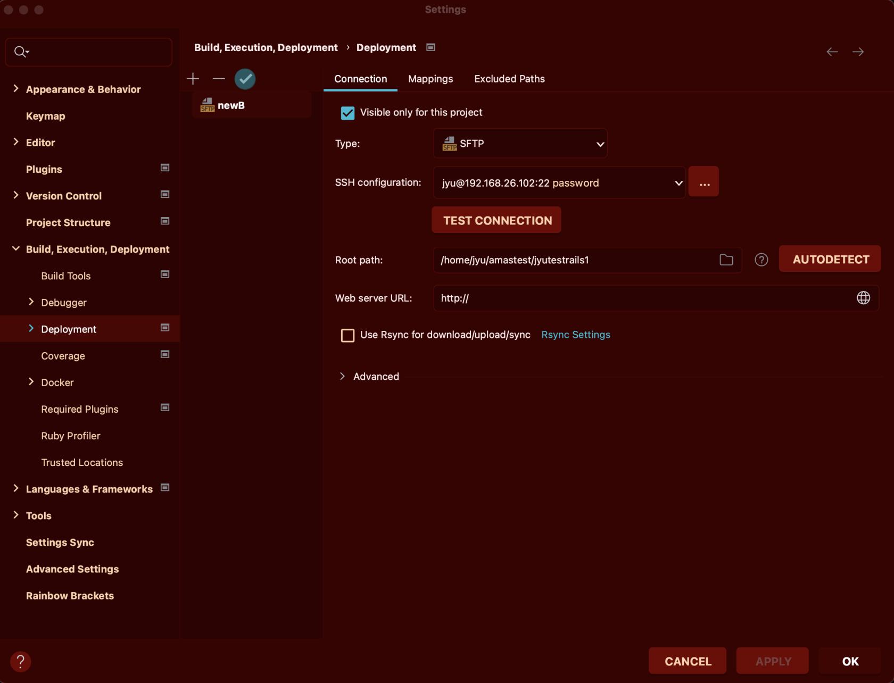
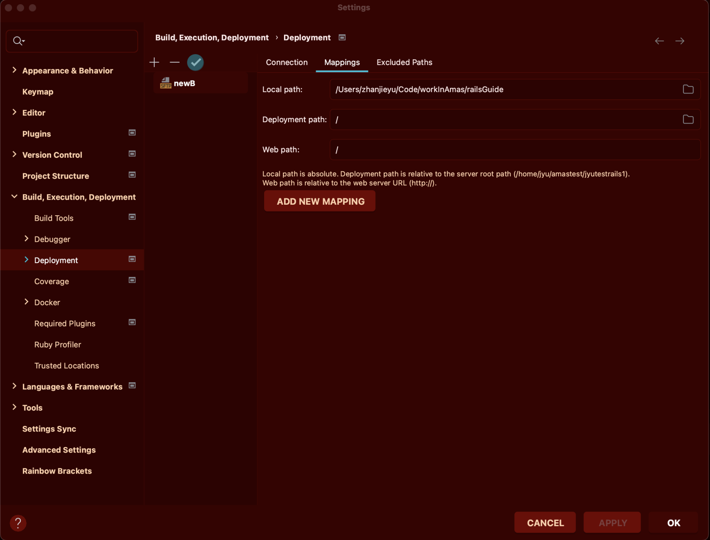
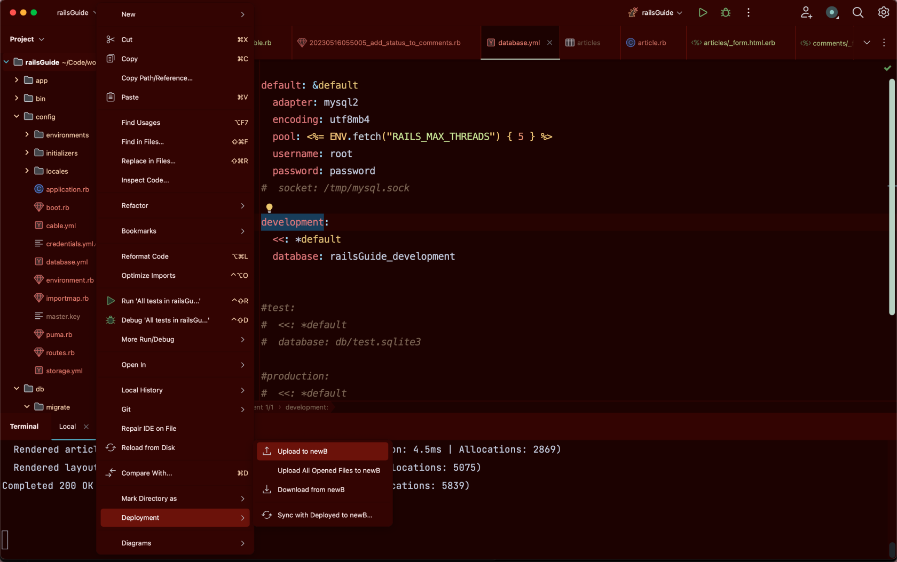
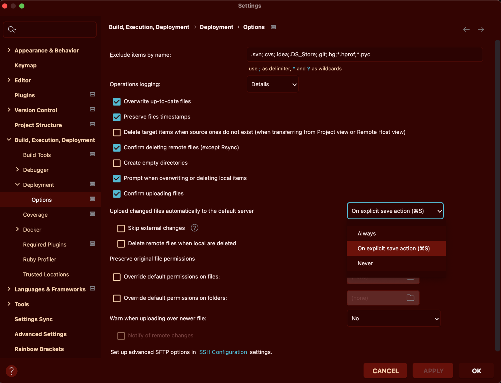

到 Setting 的 Deployment 新增（+）一個 Server，Server 名字隨便取。

Type 選擇 SFTP，Root path 選擇要上傳檔案的位置。



接著設定路徑，如果 Root Path 有設定好的話 Deployment path 就直接 / 即可。



在專案上點右鍵，選擇 Deployment > Upload to newB 即可上傳



若是初次上傳記得要下 bundle install、db:create、db:migrate。

如果要設定只上傳有修改過的檔案：



這樣就會在存檔的時候自動上傳。

要啟 server 的話可以：（如果是已經部署好的專案就不用啟 Server ㄌ～）

```
bin/rails server -b=0.0.0.0 -p=3000
```

就可以在指定 ip 的 3000 port 讀取到網站了～㈷

```
如果要搜尋更多設定，建議以 phpstorm 為關鍵字去搜，Rubymine 比較搜不到東西🫠
```