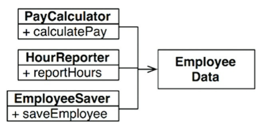
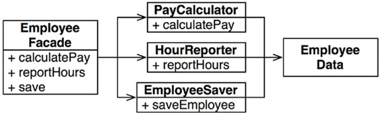

[上一篇](https://jyu1999.com/post/solid-dip/)介紹了相對好理解的 OCP 和 DIP，這篇我將接續介紹其他原則。


---

## SRP

我們先來看一下定義怎麼說的：

> _A class should have one and only one reason to change, meaning that a class should have only one job._

簡單中文翻譯一下是：「_**一個模組應該有一個，且只有一個理由會使其改變。**_」

在 _Clean Architecture_ 中有提到，通常軟體系統會被「改變」，就是為了要滿足使用者或利益相關者。我們可以把這些希望系統改變的人，統稱為**角色**（actor，參與者）。

所以書中提到 SRP 的最終版本是：

> 一個模組應該只對唯一的一個角色負責。

這裡的模組基本上是指一個 source file，但也有可能是一個由 function 和 Data Structure 相互凝聚在一起的集合。

為了更好理解 SRP，我們可以先來看看違反它會出現什麼問題。

### 違反 SRP

這裡我們直接來看例子（來源為 _Clean Architecture_）：

#### 狀況一

假設有一個 `Employee` 的 class 如下：

```php
public class Employee {

     public void calculatePay() {
         // some logic
     }

     public void reportHours() {
         // some logic
     }

     public void save() {
         // some logic
     }

}
```

`Employee` 這個 class 要做三件事情：

- `calculatePay()`：由會計部門指定
- `reportHours()`：由 HR 部門指定和使用
- `save()`：由資料庫管理人員指定

可以看到這個 class（也就是模組），一次對三個不同的 actor（角色，在這裡是部門）負責，顯然是違反了 SRP。

我們可以想像一下這樣會發生什麼問題，假設 `calculatePay()` 和 `reportHours()` 都有使用到計算正常上班時間的 function `regularHours()`：

```php
public class Employee {

     public void calculatePay() {
        $pay = 180 * regularHours() + 200 * extraHours();
     }

     public void reportHours() {
        $hours = regularHours() + extraHours()
     }

     public void save() {
         // some logic
     }

}
```

假設現在發生了一個情境：因為公司財務狀況堪憂，會計部門想要節約成本，因此想要改變正常上班時間的計算方式。

這個時候當會計部門的工程師進行修改，他會看到 `calculatePay()` 去 call `regularHours()`，但他很有可能不會注意到，其實 HR 部門也有用到這個 function。所以他就直接改了。

這就會造成 HR 部門在完全不知情的情況下，數據全部都變成錯誤的。

會出現這種問題，就是因為我們把不同角色（actor）所依賴的程式碼都放在一起，所以 SRP 鼓勵我們 _分開不同角色所依賴的程式碼（separate the code that different actors depend on）_。

#### 狀況二

我們接續上面的例子，假設資料庫管理人員決定修改 `Employees` 這個 table 的 schema。HR 部門也決定要改變 reportHour 的格式。

兩個不同的開發團隊，針對同一個類別進行修改，這個時候有使用過 git 的人應該就知道，最後 merge 或 rebase 的時候，就需要解 conflict。

而解 conflict 這件事情本身就是會帶來一些風險，最差的情況，甚至會連會計部門的服務也被影響到。

### Solution

很簡單就可以想到的解決方法是：把每個 function 都獨立成一個 class。

一樣用上面的例子，我們把 `Employee` 裡面的三個 methods 都拿出來，變成三個 class，如下圖：



這三個 class 共用了 `EmployData`，而每個 class 都只會有為了完成功能所需要的程式碼。

因為這三個 class 不需要管其他 class 在做什麼，所以就可以避免意外重複（accidental duplication，也就是狀況一）。

但很明顯可以看的出來，這樣 Class 會變得數量非常多，如果是最原本的程式碼，有一個人想要用 `reportHours()`，他只需要繼承 `Employee` 就好，但現在他需要想辦法找到 `reportHours` 在哪個 class 裡面，然後再去繼承它。

那有沒有一種方法，是既可以解決 SRP 的痛點，又可以讓我們很方便 call method 呢？

有的，一個常見的方式就是 **FACADE 模式**。

這裡我快速介紹一下 Facade 模式（想知道更多可參考[[Design Pattern] Facade 門面模式](https://ithelp.ithome.com.tw/articles/10227186)，Facade 這個詞源自於法文，意思是建築物正面，也就是所謂的「門面」。

Facade 其實就有點像是客服專員。一間公司可能有很多種服務，但我們只需要透過一個語音電話，就可以知道商品存貨、物流配送、處理退換貨等等，不用特地打到特定部門詢問。這就是多虧了客服專員，他會去幫忙處理這些複雜的資訊，處理過後整合成一兩句話給我們。

回到例子，我們可以使用一個 `EmployeeFacade`，去負責實例化和委託具有這些函式的 class：



如此我們就可以很方便的 call method，又解決 SRP 的痛點ㄌ～


---

## ISP

Cohesion: degree to which the various parts of a software component are related

Coupling: level of inter dependency between various software component

Cohesion指的是 一個元件裡面的不同元件的關聯性

Coupling指的是 不同元件裡面的依賴關係強度

我們在講S.O.L.I.D的時候 追求的都是

Aim for high cohesion and loose coupling

就是Cohesion越高越好 Coupling越鬆越好

---

## LSP

接著我們來看 Liskov Substitution Principle，定義如下：

> _Let q(x) be a property provable about objects of x of type T. Then q(y) should be provable for objects y of type S where S is a subtype of T._

我自己覺得這句話相對比較難懂一點，在 _Clean Architecture_ 中有額外再寫下了如何定義子型態：

> _若對型態 S 的每一個物件 o1，都存在一個型態為 T 的物件 o2，使得在所有針對 T 編寫的程式 P 中，用 o1 替換 o2後，程式 P 的行為功能不變，則 S 是 T 的子型態。_

[延伸閱讀](https://www.jyt0532.com/2020/03/22/lsp/)

- LSP 的 Subtype 是什麼？
    - subType: 就如同LSP定義所說 如果S是T的subType 那在所有T出現過的地方都可以用S取代 目標是讓你的架構更加彈性當然subType也是靠繼承來達成 但只有正確的繼承 才夠格被稱為subType 不正確的繼承 就只是個繼承
    - subClass: A extend B, 那你就可以說B是A的subClass 目標是code reuse

- 違反 LSP 會造成程式架構非常醜

- 如何判斷能不能用繼承 -> 7 個規則