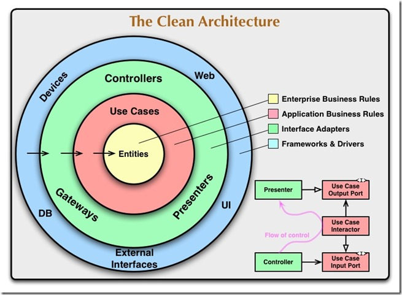

(封面圖片來源：https://www.linkedin.com/pulse/solid-principles-razneeknth-pradhan/)

## 前言

在幾個月前我正在求職時，看到很多職缺上面都有提到「SOLID」這個關鍵字，當時的我只大概知道 SOLID 是有關於物件導向的一種設計原則，但具體裡面每個原則在幹嘛也不太清楚。

直到最近終於有空好好來看一下這個大名鼎鼎（？）的 SOLID，看了很多文章，不管中文英文的，都覺得有看沒有懂，於是想要寫文章整理一下自己的思緒。

由於我也只是初步研究，不敢保證正確性，如果有覺得任何值得討論的地方，歡迎跟我說喔～

---

## SOLID 是什麼？為什麼需要？

SOLID 是五個設計原則的縮寫，分別為：

- SRP: 單一職責原則
- OCP: 開放-封閉原則
- LSP: Liskov 替換原則
- ISP: 介面隔離原則
- DIP: 依賴反向原則

我們在後續文章會再解釋每一個原則的細節，在這篇文章我想著重在「目標」上。

我們先來看一下 _Clean Architecture_ 這本書對於 SOLID 目標的描述：

>  _這些原則的目標是建立中層級的軟體架構，這樣的結構包含：_
>   
> - _能容忍變化_
> - _容易理解_
> - _是在許多軟體系統中能夠使用的元件的基礎_

ok，我在看這句話的時候產生了兩個疑惑：
1. 中層級是什麼？
2. 元件是什麼？

### 元件（Component）

因為中層級的解釋涉及到元件，所以我們先看到第二個問題，元件是什麼？

在 _Clean Architecture_ 裡面是這樣定義的：

> _元件（Component）是部署（Deployment）的單位。_
> _他們是系統在部署時最小的部分實體。_
> _在 Java 中，他們是 jar 檔。_
> _在 Ruby 中，他們是 Gem 檔。_

如果舉一反三的話，在 PHP 中，Composer package 應該就是元件？

### 中層級

#### 中層級的架構

我們再來看第一個問題，在 _Clean Architecture_ 的說明如下：

> _「中層級」是指這些原則是程式設計師在模組層級工作時應用的原則。他們應用在程式碼層級之上，並且有助於定義模組和元件內使用的軟體結構類型。_

ok，這邊又出現了一個新名詞：模組（module）。

模組和元件有何不同，我想這很難有一個明確的定義。不過我個人是同意在 [這篇文章](https://stackoverflow.com/questions/2702816/module-vs-component-design) 的回答所看到的描述：

> _Both component and module are used to refer to a group of functions or a part of a function. Module is more logical, for example: module Finance, module HR, module Manufacturing... in ERP system. On the other hand, component is more physical. In software, it can be a dll, ocx, exe,..._

怕有人看不懂，協助翻譯一下XD。以一個 ERP 系統來說，所謂的模組可能有「金流模組」、「人力管理模組」、「製造管理模組」。而為了要去實作一個「製造管理模組」，我們可能需要很多的元件。大家可以想像，我們有時候在實作一個功能的時候，是不是也需要引用很多的套件呢？

所以我們也許可以這樣理解「中層級」：
- 工程師會寫一行一行的 Code，這些 Code 屬於「程式碼層級」；
- 一行一行的 Code 組成了一個 Class，成為「類別層級」；
- 很多個 Class 組合而成一個「元件」，成為「元件層級」；
- 很多個「元件」組合起來，變成「模組」，成為「模組層級」；
- 很多個「模組」組合起來，最終成為「系統層級」

而所謂中層級，就是「程式碼層級」、「類別層級」、「元件層級」、「模組層級」的集合。至於「系統層級」算不算在「中層級」，我自己覺得不算～

#### 中層級的工作

到這邊我又有疑惑了，所以「中層級」到底主要在幹嘛？

在 _Clean Architecture_ 裡面有一張圖：

在這個架構中，愈外圈被視為愈低層，而內圈被視為高層。

我們其實可以這樣理解：「離I/O（輸入、輸出）越遠的元件層級越高，離I/O越近的層級越低」。這其實也很容易理解，在公司中，櫃台小姐離I/O（接電話、接待訪客）最近，通常層級比較低。董事長、總經理離I/O很遠，層級最高（通常看高階主管的辦公室位置離大門遠近就可猜出層級高低XD）。[^1]

[^1]: [Clean Architecture（4）：架構三原則首部曲—分層原則](http://teddy-chen-tw.blogspot.com/2018/07/clean-architecture4.html)

所以我們大概可以知道，所謂的「中層級」就是 Use Cases 和 Interface Adapters 這兩層。而這兩層大概在幹嘛呢？

- Use Cases Layer: 簡單解釋的話，就是該應用的核心商業邏輯。
- Interface Adapters Layer: 我們所熟知的 MVC 架構其實就在這一層，

> 📕
> 其實我自己也沒有很了解這兩層的具體差異在哪裡，上網找是有人說，可能要軟體架構足夠大才會有感覺QAQ

具體每一層在幹嘛，大家可以參考 [Uncle Bob 的網站](https://blog.cleancoder.com/uncle-bob/2012/08/13/the-clean-architecture.html)，會有比較詳細的解說。

### 小結

ok，我們了解了元件和中層級，我們再重新回頭看一下 SOLID 的目標：

>  _這些原則的目標是建立中層級的軟體架構，這樣的結構包含：_
>
> - _能容忍變化_
> - _容易理解_
> - _是在許多軟體系統中能夠使用的元件的基礎_

有更看得懂 SOLID 的目標了嗎（拜託說有🥺），一言以蔽之的話，SOLID 原則就是在幫助我們建造更「乾淨」的中層級。

這個中層級是要能容忍變化的，不能需求一變，就要大改程式碼。而且這個架構是要能容易被理解的。

---

## SOLID 的手段？

那具體來說，SOLID 原則能怎麼協助我們呢？一樣，我們看 _Clean Architecture_ 裡面是怎麼說的：

> _SOLID 原則告訴我們該如何將我們的函式和資料結構安排到類別（Class）中，以及這些類別該如何相互關聯。_

我很喜歡書中對於 Clean Code（整潔的程式碼） 和 Clean Architecture 的比喻：

> 從某方面來說，如果磚塊（Code）做得不好，那麼建築物的架構（Architecture）也就不重要了。
> 從另一方面來說，你也能用精心製作的磚塊來製造大量的垃圾。

所以，我們平時寫 Code 的習慣（規範？），例如有意義的 function 名稱、一行不能超過幾個字等等，就是屬於 Clean Code 的範疇。

我們寫 Code 的習慣愈好，做出來的磚頭就愈精良。但光是磚頭精良是不夠的，如果亂拼的話還是可能會出問題。

所以我們需要仔細思考，哪個磚頭要放在哪裡，才能讓房子更加穩固。

而這個「磚頭要放在哪裡」的 Guideline 就是 SOLID 原則。

---

在這一篇中我簡單講解了為什麼需要 SOLID 原則。

接下來我會從 OCP 開始，針對每一個原則逐一解說。

如果有任何問題，歡迎討論！

👉 下一篇：[SOLID 原則（二）：OCP & DIP](https://jyu1999.com/post/solid-dip/)